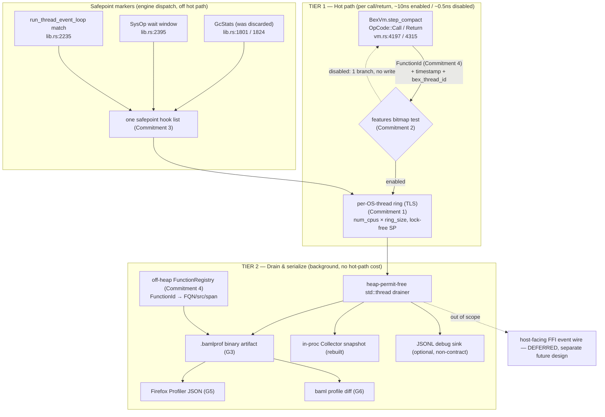
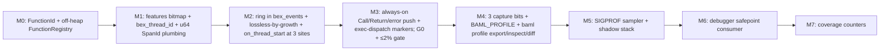

# BEX Unified Observability & Profiling Event Stream — Engineering Design

**TL;DR.** BEX has two observability shapes today and neither can profile a BAML program: `bex_events` is semantically rich but opt-in per `@trace`, deep-copies every payload, and serializes every event through one process-global `Mutex<CollectorStore>` (`crates/bex_events/src/event_store.rs:77`); native CPU samplers see `step_compact` worker frames but never the logical BAML function. This document specifies **one** unified, always-on event stream built on four architectural commitments — a per-OS-worker lock-free ring keyed by a new `bex_thread_id`, a single per-VM feature bitmap, one safepoint hook list at the engine's `VmExecState` dispatch, and a stable off-heap `FunctionId(u32)` metadata table — feeding a two-tier pipeline (lock-free hot producer → off-band cold consumer) that emits a compact `.bamlprof` artifact. **The objective is maximally correct data, not compatibility:** no existing contract is preserved (protobuf-FFI wire, `Collector`/`EventSink` API, and JSONL are all free to change), every function emits enter/exit/error unconditionally, and the stream is **lossless under all backpressure** (overflow grows into fresh heap segments rather than dropping or blocking GC). Overhead (a ≤2% CodSpeed target) is soft and yields to correctness. Three orthogonal opt-in signals — **inputs**, **outputs**, **error-values** — layer rich payload capture on top of the always-on structural stream. It additively supports future tools (SIGPROF sampler, debugger, coverage) without re-plumbing the runtime.

## Document Map

- **§1 — Goals & Architectural Commitments.** The two-shape problem, success criteria (G1–G8), the four commitments, and the two-tier pipeline.
- **§2 — Hot Path.** Feature bitmap, exact VM insertion points, safepoint hooks, disabled-cost proof.
- **§3 — Tier 1 Producer.** Per-OS-thread double-buffered ring, wire format, backpressure, safety.
- **§4 — Tier 2 Consumer.** Off-band drain, call-tree reconstruction, exclusive/inclusive timing, snapshot publication, lifecycle.
- **§5 — Function Identity & Metadata.** `FunctionId`, off-heap registry, string interning, cross-run stability.
- **§6 — Marker Integration.** GC, LLM/HTTP, FFI, scheduling markers; wire payload; schema versioning.
- **§7 — Opt-In Payload Capture (Tier 4).** Args/returns/exceptions, caps, redaction.
- **§8 — Redesigning `bex_events`.** Clean redesign with no preserved contract: `SpanId`→`u64`, Collector rebuilt, all sinks regenerated, single lossless drain path.
- **§9 — Artifact Format & CLI.** `.bamlprof`, `baml profile export/inspect/diff`, activation.
- **§10 — Concurrency, Extensibility, Testing & Rollout.**
- **§11 — Open Questions & Risks.**
- **§12 — Phased Implementation Plan.**

> ## Status / Open Risks
>
> **Scope directive (overrides the originating ticket).** We do **not** preserve any existing contract — not the protobuf-FFI event wire, not the `bex_events` `Collector`/`EventSink` API, not the JSONL shape. The single objective is **maximally correct data**: every function call emits enter/exit/error structurally and unconditionally, and the captured stream is **lossless** (no dropped events under any backpressure). Overhead (the ≤2% gate) is now a *soft* target that yields to correctness on every tie. This dissolves the entire backward-compat blocker set the verification pass found:
>
> - **DISSOLVED (was blocker): "`SpanId` must stay `uuid::Uuid`."** That constraint existed only to round-trip host-provided UUIDs across the FFI/Collector contracts. With contracts dropped, `SpanId` becomes a **monotonic `u64`** (+ `engine_id` for cross-engine uniqueness, old Q8) — *more* correct than random UUIDs because it gives true intra-run ordering/causality, and free to mint on the hot path. Host-provided ids, if ever needed again, are a separate redesigned field. (§5, §8.3)
> - **DISSOLVED (was blocker): "two/three wire consumers must stay byte-stable."** No wire is a contract. The protobuf-FFI shape, the Collector API, and JSONL are all free to change; `bex_events` is rebuilt for correctness, not reconstructed to match the old `RuntimeEvent` byte-for-byte. §8 collapses from a migration spec to a clean-redesign note. (§8)
> - **EASIER (was blocker): crate siting.** Since `bex_events` is freely rewritable and is already on the bridge allowlist (`stow.toml:134-138`), the ring lives **inside `bex_events`** directly — no `bex_project` facade gymnastics. The `stow.toml` namespace rule still applies (it's a build constraint, not an API contract), but it's now trivially satisfied. (§3.0, §8)
> - **RESOLVED (was the open blocker, Q10): backpressure is now lossless-by-growth, not drop.** A producer must never drop and must never spin while holding its `ActiveHeapPermit` (that would stall engine-wide GC — `request_park` drains all permits, `crates/bex_engine/src/lib.rs:1094`). Resolution: **on ring overflow, heap-allocate a fresh overflow segment and keep writing** — memory (the resource we've explicitly decided not to ration) is the release valve, so the producer neither blocks nor loses an event. The Tier-2 consumer remains a *hard-invariant* heap-permit-free / GC-free `std::thread` and is shardable (Q3) to keep overflow-growth bounded. (§3.6, §10.5)
>
> **Remaining genuinely-open questions** (none block implementation):
> - **Q1: wallclock vs CPU time** for inclusive/exclusive attribution — drives timestamp choice. (§11)
> - **Q3: consumer sharding** count under 1000+ logical threads — now a throughput tuning knob, not a correctness risk (correctness is guaranteed by lossless-by-growth). (§4.10, §11)

---

## 1. Goals, Background & Architectural Commitments

### 1.1 The problem: two insufficient observability shapes

**Shape A — `bex_events`: rich, lossy, slow.** The pipeline is real: the engine builds a `RuntimeEvent` and `BexEngine::emit` dual-dispatches it into a process-global in-memory `CollectorStore` and an optional `EventSink`:

```rust
// crates/bex_engine/src/lib.rs:898
fn emit(&self, event: bex_events::RuntimeEvent) {
    bex_events::event_store::emit(&event);
    if let Some(sink) = &self.event_sink { sink.send(event); }
}
```

It is unsuited to profiling for three code-grounded reasons:

1. **Opt-in per function.** Engine spans emit only for `@trace`'d functions: the VM reads `let is_traced = callee.trace;` (`crates/bex_vm/src/vm.rs:2528`) and only then snapshots args. Zero `@trace` annotations ⇒ zero function events. A profiler must see every logical frame.
2. **Every event costs a yield + deep clones.** The VM cannot emit; every span exits as a `VmExecState` yield handled in `run_thread_event_loop` (awaited at `crates/bex_engine/src/lib.rs:2138`). For traced functions the engine deep-copies every argument and the return via `vm_value_to_owned` → `as_owned_for_trace` (`crates/bex_engine/src/conversion.rs:605`). Right for Tier-4 capture; 3–4 orders of magnitude too expensive per call.
3. **Lossy, globally contended collector.** `event_store::emit` stores an event only if its `span_id` or `parent_span_id` is tracked, behind one process-global `OnceLock<Mutex<CollectorStore>>` (`event_store.rs:77`). Routing matches exactly one level (grandchildren dropped), and every emit contends one lock — fatal for a per-call profiler at 1000+ threads.

**Shape B — native CPU profilers: blind to logical frames.** A SIGPROF sampler sees `step_compact`/dispatch/tokio worker frames, never `user.MyAgent.run`. There is no `bex_thread_id` and no logical-frame map reachable from a native stack walk (children get only a `child_token()`, `crates/bex_engine/src/lib.rs:1966`).

**Two computed signals are silently discarded:**

- **GC stats.** `collect_garbage` returns full `GcStats { live_count, collected_count, level, promoted_to_gen1, promoted_to_gen2 }` (`crates/bex_heap/src/gc.rs:69`), but both heuristic callers — `gc_safepoint` (`crates/bex_engine/src/lib.rs:1801`) and `maybe_collect_garbage` (`:1824`) — call `self.collect_garbage(level).await;` with no binding.
- **Watch notifications.** `VmExecState::Notify(_)` is matched and ignored (`crates/bex_engine/src/lib.rs:2718`).

> **Original-ticket correction.** The ticket framed bytecode notifications as missing. `VmExecState::Notify` exists and is wired to the engine dispatch; it is simply ignored. The work is to *consume* an existing signal, not invent a transport.

### 1.2 Goal & success criteria

Build **one** unified observability + profiling stream: rich like `bex_events`, cheap and always-on like a native profiler, and extensible by future tool authors without re-plumbing the runtime.

The priority order is **correctness first**: G0 dominates, and G7 (overhead) explicitly yields to it.

| # | Criterion | Bar |
|---|-----------|-----|
| **G0** | **Maximally correct, lossless data** | **The dominant criterion.** Every emitted event is processed — never dropped, never reordered within a `BexThread`, never corrupted under backpressure (resolved by lossless-by-growth, §3.6). Call counts, call tree, and exclusive/inclusive timing are exact and deterministic. Where correctness and overhead conflict, correctness wins. |
| G1 | **~10 ns/event** (no "disabled" path for structural events) | Structural enter/exit/error is **always on** — there is no bitmap gate to skip it, so no "~0.5 ns disabled" state exists for it. ~10 ns = "monotonic timestamp + ring write," not a yield round-trip. A compile-time cargo feature can excise the whole subsystem for embedders who need literal zero overhead. |
| G2 | **Every function emits enter/exit/error, unconditionally** | Not "by default" — *always*. Fixes Shape A's opt-in gap; the per-function `callee.trace` check (`vm.rs:2528`) is removed from the hot path entirely. |
| G3 | **`.bamlprof` binary artifact** | Compact append-only borsh-encoded log, `FunctionId`-keyed. |
| G4 | **Three orthogonal payload opt-ins** | On top of always-on structural tracing, **inputs**, **outputs**, and **error-values** are three *independent* capture signals (separate feature bits, settable per-function or per-session). Each, when off, costs nothing beyond the structural event; when on, deep-copies that one payload class. No wire/contract is preserved (§8). |
| G5 | **Firefox Profiler export** | Logical BAML frames → call tree; GC pauses and SysOp waits → markers. |
| G6 | **`baml profile diff` for CI** | Nested `baml profile {export,inspect,diff}` for regression gating. Exactness (G0) is what makes diff trustworthy. |
| G7 | **≤2% benchmark target (soft)** | CodSpeed CI on `crates/baml_tests/benches/runtime_benchmark.rs` (release-only; debug no-op at `:17`) via the `codspeed-divan-compat` shim (`Cargo.toml:151`, `cfg(codspeed)` at `:256`). **Demoted from hard constraint to target:** since structural tracing is always-on, this is the permanent steady-state cost; we drive toward ≤2% but G0 takes precedence, and the true zero-overhead baseline is a compiled-out build. Add a call-heavy canary, since the existing `vm_loop`/`vm_field_access` benches are call-light. |
| G8 | **Scales to 1000+ concurrent `BexThread`s** | Rules out anything per-`BexThread` that touches a shared lock per event. |

> **Original-ticket correction (deps & gate).** Only `parking_lot` (`Cargo.toml:171`) and `crossbeam-channel` (`:147`) exist. `quanta`, `crossbeam-utils`, `arc-swap`, `bitflags`, `loom`, `core_affinity`, `num_cpus` are **not** declared and would each be a new `[workspace.dependencies]` entry. The ≤2% gate is **CodSpeed CI**, not a local script.

> **Scope directive (no contract is preserved).** The originating ticket and an earlier draft treated several surfaces as frozen wires: byte-for-byte JSONL (`event_to_jsonl`, `crates/bex_events/src/serialize.rs:186`), the protobuf-FFI event stream (`runtime_event_to_proto`, `crates/bridge_ctypes/src/event_encode.rs:17`), and the in-proc `Collector`/`EventSink` API. **None of these is a constraint.** The single objective is *maximally correct data*; if breaking any of them yields a cleaner or more correct design, we break it. Concretely: `SpanId` becomes `u64` (§5), `bex_events` internals are rebuilt rather than reconstructed (§8), and the Collector snapshot + optional JSONL are regenerated from the new model in whatever shape best serves the data. The **host-facing protobuf-FFI wire is not emitted by this design at all** — it is parked and left to a separate future design once the bridges decide what they want (§8.5). Wherever this doc says "feed a sink," it means "we can emit one from the canonical event," never "we must match old bytes."

### 1.3 The four architectural commitments

#### Commitment 1 — One event ring per OS thread (not per `BexThread`)

Profiling events are written into a lock-free, single-producer ring in **thread-local storage on the tokio worker OS thread**. A background drainer feeds Tier-2 sinks.

**Rationale.** A `BexThread` is an async task that migrates across tokio workers at every await — each `SysOp`/`Await` releases and re-acquires the heap permit, possibly on a different worker (`crates/bex_engine/src/lib.rs:2395`, `:2587`). The engine never builds its runtime; it uses the ambient one via `tokio::spawn` (`:2030`). The only stable, bounded-cardinality keying unit is the OS worker thread (`num_cpus`-many), not the unbounded set of logical `BexThread`s (G8). Memory: `num_cpus × ring_size` is a small constant (16 × 512 KiB ≈ 8 MiB) regardless of 1000+ logical threads. A single-producer ring needs no per-event lock, eliminating the `CollectorStore` global-`Mutex` contention on the hot path.

> **Original-ticket correction.** There is no `bex_thread_id` concept (it must be invented), and `bex_engine` does not own a runtime to hang `on_thread_start` on. Worker-thread hooks must be installed where runtimes are built — `crates/bridge_cffi/src/lib.rs:64`, `crates/baml_cli/src/run_command.rs:656` & `:936` — switching `Runtime::new()` to `Builder::new_multi_thread().on_thread_start(...)`. The ring producer API lives in **`bex_events`** (already on the bridge allowlist, `stow.toml:134-138`), so bridges install the hook through their existing `bex_events` dependency — no new crate, no facade (§8.6). Logical identity travels in the record header as `bex_thread_id`; the OS thread only owns ring *storage*.

#### Commitment 2 — One feature bitmap

A single cheaply-readable bitmap of enabled features gates the *optional* tiers (`CAPTURE_ARGS`, `CAPTURE_RESULT`, `CAPTURE_ERROR`, `GC`, `SYSOP`, `SIGPROF`, `COVERAGE`, …). The disabled path for any optional tier is one bitmask test against a `Copy` value the VM already holds.

> **Structural enter/exit/error is NOT in the bitmap — it is unconditional (G0/G2).** There is no `FUNC`/`SPAN_TRACE` flag gating the always-on skeleton: every Call/Return/error emits a structural record into the ring with no flag check. The per-function `callee.trace` bool (`vm.rs:2528`) is removed from the hot path. The bitmap exists only to gate the *expensive optional* work layered on top.

**Rationale.** `BexVm` has no feature/engine reference today (`crates/bex_vm/src/vm.rs:433-514`); the closest field is `current_span_context`, which the engine writes in before each exec step (`crates/bex_engine/src/lib.rs:2135`). We add exactly **one** `features: Features` field, mirrored from the same site. One bitmap (not one bool per feature, not per-feature plumbing) so future tools claim a bit instead of threading a flag through every call site.

> **The three payload signals are independent bits.** Per the scope directive, payload capture is *not* one knob: `CAPTURE_ARGS` (inputs), `CAPTURE_RESULT` (outputs), and `CAPTURE_ERROR` (error values) are three orthogonal bits, settable per-function or per-session, each gating exactly one `as_owned_for_trace` deep copy (`crates/bex_engine/src/conversion.rs:605-611`). A function can capture inputs but not outputs, errors but not inputs, etc. The structural enter/exit/error events fire regardless; these bits only decide whether the *values* ride along.

#### Commitment 3 — One safepoint hook list

All non-hot-path producers (GC pauses, SysOp waits, spawn/await) emit through **one** ordered hook list invoked at the engine's `VmExecState` dispatch arms (`crates/bex_engine/src/lib.rs:2235`), not scattered ad-hoc emits. We capture the two discarded signals here: GC markers bind the `GcStats` dropped at `:1801`/`:1824` (safe under the single-checker `checking_gc` CAS — exactly one VM emits per GC cycle); SysOp waits wrap the existing release/select/re-acquire window (`:2395-2402`). One list lets a future tool register a consumer once and receive all safepoint events.

#### Commitment 4 — One function metadata system (off-heap, id-keyed)

Every function gets a stable `FunctionId(u32)` and an entry in an **append-only, off-heap** `FunctionRegistry` (FQN, source_file, span, kind, origin). Events carry the `FunctionId`, not the FQN string.

**Rationale.** Runtime function identity is the `HeapPtr` to `Object::Function(Box<Function>)` (`crates/bex_vm_types/src/types.rs:1581`), stored in `BytecodeFrame.function` (`crates/bex_vm/src/vm.rs:94`). The GC moves and forwards these pointers (`forward_roots` rewrites `frame.function`) — a `HeapPtr` is **not** stable across collections, so it cannot key a profile artifact. The FQN `String` is stable but fat to write per call. A `u32` id resolved through an off-heap table is both stable and cheap. The id is minted at the emit funnels in `crates/baml_compiler2_emit/src/lib.rs` (§5.3 enumerates all five). The table is owned by `Program` (the Borsh-serializable artifact). `FunctionId` lives behind `Box<Function>`, so it does not affect the `size_of::<Object>() <= 80` assert (`types.rs:1672`). The `FunctionMeta` mirror collapses `FunctionKind::Native(*const ())` to `NativeUnresolved` exactly as the existing Borsh proxy does (`types.rs:289`).

### 1.4 The two-tier pipeline

A **lock-free hot tier** (VM → per-OS-thread ring; structural events unconditional, the three capture bits and markers bitmap-gated) and a **drain/serialize cold tier** (background consumer → rebuilt in-proc Collector snapshot + `.bamlprof` + optional JSONL debug sink, no hot-path cost). The cold tier is the single point that builds the canonical event and feeds every sink (§8.5); the ring is lossless-by-growth (§3.6). **A host-facing FFI event wire is explicitly out of scope** — when the bridges want one, it is a separate future design layered on the same canonical event (§8.5).



**Why two tiers.** Single-tier `bex_events` pays serialization, UUID minting, and a global `Mutex` *on the producing thread, per event*. The split moves all of that behind the ring boundary: the hot tier writes a fixed-size record and returns; the cold tier (a dedicated heap-permit-free thread modeled on the existing `bex_events_native` channel+thread+writer, `crates/bex_events_native/src/lib.rs:77`) does id-resolution and encoding off the critical path. This is the only structure satisfying G1, G7, and G8 simultaneously.

> **Reconciliation with §8.** The global `Mutex<CollectorStore>` contention is removed *from the VM hot path* but **retained** on the single consumer thread for backward compat (§8). Because there is exactly one writer, that lock is uncontended — a bare acquire, not the N-way contention the producer path had.

---

## 2. Hot Path: Feature Bitmap, Safepoint Hooks & Call/Return Emission

### 2.1 What the ticket got wrong, and the corrected model

> **Ticket claim:** "A `fast_emit` hook drops into `step_compact` as one branch + one timestamp + memcpy."

Three verified blockers:

1. **No feature/engine reference on `BexVm`.** The struct (`crates/bex_vm/src/vm.rs:433-514`) ends at `pending_call_type_args`. No engine handle, no feature word, no event sink. Closest is `current_span_context: Option<bex_events::SpanContext>` (`:494`), which the engine writes in.
2. **The VM cannot emit.** Every event leaves as a `VmExecState` yield handled in `run_thread_event_loop` (`crates/bex_engine/src/lib.rs:2138`, dispatch at `:2235`).
3. **No `bex_thread_id` / `SpanId` on the hot path.** `SpanId::new()` is minted engine-side (`crates/bex_engine/src/lib.rs:1370`); parent/root/`call_stack` live in `SpanState` (`:224-231`).

**Corrected model.** The ticket's "one branch + memcpy" *outcome* is achievable, but only after we give the VM two things it lacks today: (1) a small `Copy` `features` word, plumbed in exactly like `current_span_context` is today, set per `exec()` step (`:2135-2136`); and (2) **direct write access to its per-OS-thread ring** via a TLS pointer (§3.2). With those, the structural enter/exit is a *direct ring `memcpy`* — **not** a `VmExecState` yield. Blocker #2 ("the VM cannot emit") is overcome by adding exactly that emit capability; blocker #3 dissolves because the producer emits **no** span id at all (the consumer assigns it, §3.5/§8.3). The yield mechanism survives only for tools that need synchronous engine handling (debugger). Genuinely hot arithmetic/load/store ops never reach Call/Return, so they are untouched.

### 2.2 The `Features` bitflags set and `AtomicFeatures`

`bitflags` is a **new** dependency. Define in `bex_vm_types` (which `bex_vm` already depends on):

```rust
// crates/bex_vm_types/src/features.rs
bitflags::bitflags! {
    #[derive(Clone, Copy, PartialEq, Eq, Debug, Default)]
    pub struct Features: u32 {
        // NOTE: there is NO bit for structural enter/exit/error. Per G0/G2 it is
        // unconditional and never gated. The bitmap gates only optional work.

        // The three orthogonal payload-capture signals (scope directive):
        const CAPTURE_ARGS    = 1 << 1; // deep-copy inputs  (independent)
        const CAPTURE_RESULT  = 1 << 2; // deep-copy outputs (independent)
        const CAPTURE_ERROR   = 1 << 3; // deep-copy error value (independent)

        // Marker tiers:
        const PROFILE_GC      = 1 << 5;
        const PROFILE_SYSOP   = 1 << 6;

        // Reserved future tools:
        const SIGPROF_SAMPLE  = 1 << 8;  // reserved
        const DEBUGGER_STEP   = 1 << 9;  // reserved
        const COVERAGE        = 1 << 10; // reserved
        const _RESERVED_HI    = 0xFFFF_F000;
    }
}

pub struct AtomicFeatures(std::sync::atomic::AtomicU32);
impl AtomicFeatures {
    #[inline] pub fn load(&self) -> Features {
        Features::from_bits_truncate(self.0.load(std::sync::atomic::Ordering::Relaxed))
    }
}
```

**Layout rationale.** There is deliberately **no** `SPAN_TRACE`/`PROFILE_CALLS` bit: structural enter/exit/error and the call counters/timing derived from them are always-on (the consumer computes counts/exclusive/inclusive from the always-present stream — Commitment 4 / §4). Bits 1–3 are the three independent payload signals, each gating exactly one `as_owned_for_trace` deep copy (`crates/bex_engine/src/conversion.rs:605-611`); clearing all three leaves a complete structural+timing trace with no values. Bits 5–6 are markers. Bits 8–10 are **reserved, emit nothing today**, but are part of the wire layout so a sampler/debugger/coverage tool can be added without renumbering.

### 2.3 Where it lives and how `step_compact` reaches it

`AtomicFeatures` lives on `BexEngine` (one source of truth, mutable at runtime by `BAML_PROFILE` parsing). The VM gets a plain `Features` **snapshot** (not a reference — adding `Arc<BexEngine>` would create a cycle, and a `Copy` value is the cheapest possible read). Add one field to `BexVm` after `current_span_context` (`crates/bex_vm/src/vm.rs:494`):

```rust
    pub features: bex_vm_types::Features,
```

Initialize `Features::empty()` in both constructors: real `BexVm::new` (constructor at `crates/bex_vm/src/vm.rs:853`, field inits at `:906-907`) and `test_vm` (inits at `:235-236`). The engine refreshes it at the existing per-step write site, alongside `current_span_context`:

```rust
// crates/bex_engine/src/lib.rs:2135-2136 — current_span_context is DELETED (§8.1).
// This per-step site now writes only the two new words:
thread.vm.features      = self.features.load();   // one Relaxed load per step, engine-side
thread.vm.bex_thread_id = thread.bex_thread_id;   // logical id stamped into the ring header
```

This is engine-side per-step setup, *outside* the tight loop. Inside `step_compact` both reads are struct-field loads, not atomics.

**On `bex_thread_id`:** span/parent/root identity is no longer minted anywhere on the engine/VM side — the consumer derives it (§8.3). The VM stamps only `bex_thread_id` (§10.1.1) into each record header at this `:2135-2136` site, so the consumer can demux migrated logical threads.

### 2.4 Why `Relaxed` loads are safe

1. **No data depends on it.** A torn/stale read at most adds or drops one span event at the instant features toggle; it never affects the program's result.
2. **Single-writer/single-reader snapshot.** Only `run_thread_event_loop` writes `thread.vm.features`, and only that VM's `step_compact` reads it, both in the same async task between awaits. The atomic is crossed once, engine-side.
3. **Consequences are weaker than the existing cooperative-GC check.** `should_early_yield()` decides cooperative GC yields; a feature gate has lighter consequences and needs no stronger ordering.

### 2.5 Exact insertion points

> **Model shift (scope directive).** Structural events no longer ride the `SpanNotify` *yield* back to the engine — that round-trip is the ~500 ns cost Shape A pays. Under always-on tracing the VM **pushes a compact structural record directly into its per-OS-thread ring** (§3) inside `step_compact`, with no yield and no bitmap check. The yield mechanism is retained only where a tool genuinely needs synchronous engine-side handling (debugger step, §10.2). The three capture bits decide whether a *value-bearing* record is additionally pushed.

**Enter — `execute_call_from_locals_offset`, `FunctionKind::Bytecode` arm** (`crates/bex_vm/src/vm.rs:2626-2683`, reached by both `OpCode::Call` and `CallIndirect`). Replace the `let is_traced = callee.trace;` filter (`vm.rs:2528`) with an **unconditional** structural push plus three independent value gates:

```rust
// Structural enter — ALWAYS, no flag check (G0/G2). Just a tagged fn_id + tick into the TLS ring.
// No span id minted, no parent/root, no name clone — the consumer derives all of that (§3.5/§4).
self.ring_push_fn_start(callee.function_id);            // ~10 ns: monotonic tick + ~5-byte memcpy

// Inputs — only if CAPTURE_ARGS is set for this engine/function (independent signal):
if self.features.contains(Features::CAPTURE_ARGS) {
    let args = self.stack[locals_offset..].to_owned();  // the one permitted deep copy
    self.ring_push_fn_args(&args);                      // binds to the top-of-stack frame in the consumer
}
```

`function_id` is the off-heap `FunctionId(u32)` (§5), not a cloned name. The VM mints **no** span id and tracks **no** `current_span` — that state moves entirely to the consumer.

**Exit — `OpCode::Return`** (`crates/bex_vm/src/vm.rs:4315-4357`) and the **error/unwind** paths (`vm.rs:2202`, `:2297`):

```rust
let result = self.stack.ensure_pop();
self.ring_push_fn_end(status);                          // ALWAYS, 1-byte status (Ok|Error)
if status.is_ok() && self.features.contains(Features::CAPTURE_RESULT) {
    self.ring_push_fn_result(&result);                  // outputs — independent signal
}
if status.is_err() && self.features.contains(Features::CAPTURE_ERROR) {
    self.ring_push_fn_error(&err_value);                // error value — independent signal
}
```

> **Balance invariant (critical, and now simpler):** because the structural enter/exit push is unconditional, *every* entered frame emits exactly one end record — on the normal Return path **and** on every frame popped during exception unwinding (`vm.rs:2202`, `:2297`). The producer keeps no span stack; balance is purely a property of emitting one `FN_END` per `FN_START`, which the unwinder must honor. The consumer's reconstructed stack (§4) is then balanced by construction, and the three capture-bit checks affect only whether *value* records accompany the structural pair.

### 2.6 Safepoint hook table and the safepoint arms

The reserved-bit tools run at safe points — the `VmExecState` yield boundaries. A swappable hook table on `BexEngine`, using **arc-swap** (new dependency), lets tools install/replace hooks without a read-path lock. Hooks are consulted only when the gating bit is set, so the `ArcSwap::load` never runs in a plain disabled execution.

| `VmExecState` arm | Site | Safepoint role | Gating bit |
|---|---|---|---|
| `EarlyYield` | `lib.rs:2806` (`gc_safepoint`) | **the** cooperative GC/sampler point in pure compute | `SIGPROF_SAMPLE` |
| `SysOp` release | `lib.rs:2395-2402` | permit released → safe to sample blocked task | `PROFILE_SYSOP` |
| `Await` release | `lib.rs:2587-2601` | permit released; resolved value available after | `PROFILE_SYSOP` |
| inside `collect_garbage` | `lib.rs:1112` (stats) | GC marker | `PROFILE_GC` |
| step boundary (debugger) | `lib.rs:2721` | synchronous pause/step | `DEBUGGER_STEP` (reserved) |

Structural call boundaries are no longer in this table: they push directly to the ring (§2.5), not through the yield-based hook list. `Notify` (`:2718`, ignored) and `Spawn` (`:2478`, mid-frame-construction) are not sampling safepoints. The most valuable reserved hook is `EarlyYield`→`gc_safepoint` (`:2806`): the only point reached during long pure-compute loops (`vm_loop_500k`), exactly where a wall-clock sampler must run.

### 2.7 Cost model: the always-on floor, and what the bitmap still saves

> **Original-ticket / draft correction (blocker).** The earlier draft justified the disabled cost as "free relative to the early_yield atomic load already paid on every Call/Return." **This is false.** `EarlyYieldCheck::should_early_yield` (`crates/bex_vm_types/src/lib.rs:116-118`) is a counter decrement — `self.counter -= 1; if self.counter != 0 { return false; }` — that touches the `AtomicBool` only once every `EARLY_YIELD_INTERVAL = 1 << 25` (~32M) instructions (`:72`). On the common Call/Return it is a `subs`/`b.ne`, **not** an atomic load. So there is no per-call atomic to piggyback on. The cost argument is re-anchored on the work that *is* genuinely paid on the Call/Return path.

**There is no byte-identical-disabled path for structural events anymore.** Under the scope directive every Call/Return unconditionally does a monotonic-timestamp + ring write (~10 ns), so the relevant claims are now (a) the **tight inner loop is still untouched** — the structural push lives only in the Call/Return handlers, never in the arithmetic/load/store arms, so call-free benches (`vm_loop_500k`, `vm_field_access_50k`) see zero change; (b) the structural floor is bounded and ~10 ns/call; and (c) the **capture bits and markers** still have a true disabled path (one `Features::contains` = `and` + `test/jz` on an L1-resident field). The literal-zero-overhead option is the compile-time cargo feature that excises the subsystem.

- `thread.vm.features = ...` writes the live set (one `u32` store, engine-side, outside the tight loop, alongside the `current_span_context` write already there).
- Enter/Exit: the structural ring push runs unconditionally; the three `Features::contains` checks (`CAPTURE_ARGS`/`RESULT`/`ERROR`) each fold to one branch over an already-paid frame-push + allocation path.

**Cost model, correctly anchored on genuinely-paid Call/Return work.** `OpCode::Call` always `return result;`s out of the tight inner loop (`vm.rs:4210`) after the `bf.instruction_ptr = *pc` writeback (`:4188`). `CallIndirect` (`vm.rs:4214-4312`) returns only on a yield: the `HostClosure` arm returns at `:4253`, but the `BoundMethod` (`:4281-4289`) and plain-callee (`:4299-4307`) arms fall through to the `early_yield` check at `:4309-4311` and continue the tight loop on the common `None` case — though they still pushed a new frame, so the outer loop re-extracts on the next iteration. Crucially, the enter hook lives in the shared `execute_call_from_locals_offset` reached by both paths, so the gating argument holds. On that path the genuinely-paid work is: the `Vec` frame push, `allocate_real_locals_for_frame`, `load_function`, and the type-arg clone (`vm.rs:4154-4176`, `:2656-2663`).

- *Always-on structural floor:* ~10 ns/Call and ~10 ns/Return = monotonic timestamp + a `memcpy` of a fixed-size record into the TLS ring (§3), no yield, no `SpanId::new()` UUID mint (now a `u64` increment), no name clone (a `FunctionId(u32)`). This is the permanent cost; call-free benches are unaffected, call-heavy benches pay it (G7 target, with a new call-heavy canary).
- *Capture bits (optional):* when a signal is **off**, one `and`+`test/jz` over an already-paid frame-push+allocation path — sub-1 ns. When **on**, that one payload class is deep-copied via `as_owned_for_trace` (~100 ns–µs), into its own value record. The three are independent, so the cost is strictly additive per enabled signal.

---

## 3. Tier 1 — Per-OS-Thread Double-Buffered Ring (Producer)

> **Scope.** The producer-side hot-path data structure: a lock-free per-OS-thread byte ring the VM/engine write event records into without taking the global `event_store` mutex or yielding. Tier 2 (§4) drains rings → canonical events; sinks (Collector snapshot / `.bamlprof` / optional JSONL) sit on top. A host-facing FFI wire is deferred (§8.5).

### 3.0 Why a new structure — correcting the ticket

The producer is genuinely new machinery: the VM cannot emit today (no sink, no engine handle, no thread id; `crates/bex_vm/src/vm.rs:433-514`). Tier 1 creates a TLS ring the producer `memcpy`s into directly, **no yield**. It also **introduces** `bex_thread_id` (a `u32` minted at logical-thread creation) stamped into every record header so Tier 2 can demux interleaved rings. "Per-OS-thread" is the *storage* allocation key (cheap TLS, bounded by `num_cpus`), **not** logical-thread identity — a `BexThread` migrates workers across awaits (`crates/bex_engine/src/lib.rs:2395-2402`, `:2587-2601`), so the logical id travels in the header.

> **Crate siting (now trivial — contracts dropped).** Earlier this was a blocker: a new `bex_ring` crate could not be a `bridge_cffi` dependency (the bridge namespace rule, `stow.toml:134-138`, `allowed_crates = []`, permits only `{bex_project, bex_events, bex_events_native, bex_heap, bex_resource_types}`). Since the scope directive lets us freely rewrite `bex_events` — which is **already on the bridge allowlist** — the ring + consumer live **inside `bex_events`** (or a sibling that `bex_events` re-exports), so `bridge_cffi` installs the `on_thread_start` hook through the existing `bex_events` dependency with no facade. `bex_vm`→`bex_events` for the producer push API is a within-`bex_*` edge permitted by the baml-namespace rule. `cargo stow --check` confirms; the `stow.toml` rule is satisfied as-is, no edits to it required.

```
 worker OS thread A   worker OS thread B          (tokio pool — migrates)
 ┌──────────────┐     ┌──────────────┐
 │ LOCAL_RING A │     │ LOCAL_RING B │            TLS: one ring per worker
 └──────┬───────┘     └──────┬───────┘
   records tid=7         records tid=7  (same logical thread, migrated A→B)
        └────────────┬────────┘
                     ▼
            Tier 2 consumer (heap-permit-free std::thread)
            demux by bex_thread_id → reconstruct call tree (assign span ids)
```

### 3.1 `DoubleBufferedRing` — layout

Two equal byte halves plus a per-half `AtomicU8` state. The producer writes the *active* half with ordinary non-atomic stores; the only cross-thread sync is the per-half state and a release/acquire pair on swap.

```rust
// crates/bex_events/src/ring.rs (re-exported by bex_events for bridges + the VM)
#[repr(u8)]
enum HalfState { Empty = 0, Writing = 1, Ready = 2, Reading = 3 }

struct Half {
    buf: std::cell::UnsafeCell<Box<[u8]>>,   // disjoint-by-state-machine (§3.8)
    committed_len: std::sync::atomic::AtomicU32,
    state: CachePadded<std::sync::atomic::AtomicU8>,  // crossbeam_utils OR #[repr(align(64))]
}

pub struct DoubleBufferedRing {
    halves: [Half; 2],
    active: usize, len: usize, half_bytes: usize,  // producer-local, no atomics
    bex_thread_id: u32,                             // stamped into every header
}
unsafe impl Send for DoubleBufferedRing {}
unsafe impl Sync for DoubleBufferedRing {}
```

`CachePadded` keeps the two halves' atomics on separate cache lines. The hot path is a `memcpy` + a `usize +=`, nothing more.

### 3.2 TLS `LOCAL_RING` pointer

```rust
thread_local! {
    static LOCAL_RING: std::cell::Cell<*mut DoubleBufferedRing> =
        const { std::cell::Cell::new(std::ptr::null_mut()) };
}
```

**Installation (corrected).** The engine never builds its runtime (`tokio::spawn` ambient, `crates/bex_engine/src/lib.rs:2030`). The `on_thread_start` hook is installed at the three real construction sites — `crates/bridge_cffi/src/lib.rs:64`, `crates/baml_cli/src/run_command.rs:656` & `:936` — switching `Runtime::new()` to a `Builder`, calling the `bex_events::ring` API (per §3.0). Rings allocate per worker OS thread there, but `bex_thread_id` is **not** set at `on_thread_start`; it is written into the ring's `bex_thread_id` field by the engine at the start of each `run_thread_event_loop` iteration — the same per-step site (§2.3, `:2135-2136`) — keeping the OS/logical split honest across migration.

### 3.3 The 4-state half state machine

Exactly **two** atomic cross-thread transitions per half; the rest is producer-local:

| Transition | Owner before→after | Atomic op | Ordering |
|---|---|---|---|
| `Empty → Writing` | consumer → producer | `compare_exchange` | `Acquire` success |
| `Writing → Ready` | producer → limbo | `store(committed_len, Release)` then `store(state=Ready, Release)` | `Release` |
| `Ready → Reading` | limbo → consumer | `compare_exchange` | `Acquire` success |
| `Reading → Empty` | consumer → limbo | `store(state=Empty, Release)` | `Release` |

Writes inside `Writing` are plain non-atomic stores, visible to no other thread until the swap-out `Release`.

### 3.4 `push_record` — the producer protocol

```rust
#[inline]
pub fn push_record(&mut self, rec: &[u8]) -> PushResult {
    debug_assert!(rec.len() <= self.half_bytes);
    if self.len + rec.len() > self.half_bytes {
        if !self.swap_active() { return PushResult::Dropped; } // bounded-spin / drop, §3.6
    }
    let buf = unsafe { &mut *self.halves[self.active].buf.get() };
    unsafe { std::ptr::copy_nonoverlapping(rec.as_ptr(), buf.as_mut_ptr().add(self.len), rec.len()); }
    self.len += rec.len();
    PushResult::Ok
}
```

The common case is branch + `copy_nonoverlapping` + `+=` — no atomic. The swap path is amortized: at 256 KiB halves and ~32-byte records, a swap happens once per ~8000 records. Spin uses bounded backoff (spin → `yield_now`), never `park`/`sleep` — the producer is on a tokio worker.

### 3.5 Wire format — header + tags

16-byte fixed header, little-endian (same-process):

```
HEADER: tag u8 | flags u8 | payload_len u16 | bex_thread_id u32 | ts_nanos u64
```

`ts_nanos` is a process-monotonic read; Tier 2 rebases to `SystemTime` at drain (§8.4 — but see §8 for the deliberate decision to keep `SystemTime::now()` on the cold path rather than add `quanta`).

**Demux + reconstruction rule:** records carry **no span identity at all** — only `bex_thread_id` (header) and event order. Per-OS-thread rings interleave migrated logical threads, so Tier 2 first regroups records by `bex_thread_id`, then walks each thread's records *in tick order* maintaining a LIFO stack: each `FN_START` is pushed (and assigned a fresh monotonic `u64` span id, with its parent = current stack top, root = stack bottom), each `FN_END` pops and pairs. Span identity, parent, root, depth, and call stack are **all reconstructed here** — none is on the wire.

**Records are minimal — everything derivable is omitted.** `function_id` is the off-heap `FunctionId(u32)` (§5). Value records reference a borsh blob in the per-thread arena. Note how small the always-on structural pair is:

```
TAG_FN_START  = 0x01 : function_id u32                                  (4-byte payload)
TAG_FN_END    = 0x02 : status u8                                        (1-byte payload; Ok|Error)
                       (duration is END.tick − matching START.tick, computed by the consumer)
TAG_FN_ARGS   = 0x03 : arena_off u32  len u32                           (only if CAPTURE_ARGS)
TAG_FN_RESULT = 0x08 : arena_off u32  len u32                           (only if CAPTURE_RESULT)
TAG_FN_ERROR  = 0x09 : arena_off u32  len u32                           (only if CAPTURE_ERROR)
TAG_SET_TAGS  = 0x04 : pair_count u16 [(klen,k,vlen,v)*]
TAG_LOG       = 0x05 : level u8 ... data[borsh]
TAG_MARKER    = 0x06 : marker_kind u8 [kind_payload]                    (GcStats etc.)
TAG_CUSTOM    = 0x07 : name ... data[borsh]
TAG_CPU_SAMPLE = 0x40: RESERVED for SIGPROF (out-of-band band, §10.2.1)
```

All of `0x03`–`0x09` value/aux tags attach to "the frame currently on top of this thread's stack," so they need no span id either — the consumer binds them to the span it just assigned. The three value tags (`0x03`/`0x08`/`0x09`) are the *only* records carrying deep-copied payloads, each gated by its capture bit; `FN_START`/`FN_END` always fire. The structural enter/exit pair is **5 payload bytes total** — that is the point of "construct after the fact, don't densely pack." Tag space: `0x01–0x3F` inline tags, `0x40–0x7F` out-of-band sampler/debugger, `0x80+` reserved; unknown tags skip via `skip = 16 + payload_len`.

> **Sink generation (no preserved bytes).** The consumer builds the canonical event and serializes it into each sink's *current* shape — the `.bamlprof` record, the in-proc Collector snapshot, and (optionally) a JSONL debug sink. None is byte-pinned to a legacy format. A host-facing FFI wire is not produced here (deferred, §8.5).

### 3.6 Backpressure: lossless-by-growth (the correctness keystone)

> **Why neither "spin" nor "drop" is acceptable.** Two non-options:
> - **Spin** — a producer spinning synchronously inside `step_compact` (via `yield_now`) holds its `ActiveHeapPermit<BexThread>` for the spin duration; the permit releases only at the async `SysOp`/`Await` boundaries a spinning `step_compact` never reaches. GC's `collect_garbage` → `request_park` drains all `MAX_PERMITS` and blocks until every permit releases (`crates/bex_engine/src/lib.rs:1094`). An unbounded-spinning producer thus stalls **every GC engine-wide**, and the `cancelled()` escape doesn't fire on GC pressure. Spinning-while-holding-the-permit is a latent deadlock.
> - **Drop** — violates G0. The whole directive is *maximally correct data*; silently discarding structural events (as the legacy `NativeEventSink` does on a full `sync_channel(4096)`, `crates/bex_events_native/src/lib.rs:57-59`) is exactly what we're eliminating.

**Resolution — grow, don't block, don't drop.** When the active ring half fills and the other half is not yet reclaimed by the consumer, the producer **heap-allocates a fresh overflow segment** (same `HALF_SIZE`) from a thread-local free-list, links it after the current half, and keeps `memcpy`-ing — never spinning, never yielding, never touching the heap *permit* (the allocation is a plain `alloc`, not a GC-heap operation). The consumer drains overflow segments in order alongside the primary halves and returns them to the free-list. Memory — the one resource the directive explicitly declines to ration — absorbs every burst, so:

- **No event is ever lost** (structural, value, marker), satisfying G0.
- **No producer ever stalls**, so GC is never blocked by the event system.
- Steady-state still uses the two pre-allocated halves; segments are allocated only under genuine burst and recycled, so the common path has zero allocation.

**Bounded growth.** Overflow is bounded by `burst_events × record_size` over one consumer drain interval. Under pathological sustained overproduction (consumer can't keep up *on average*, not just in bursts), the answer is **consumer sharding** (Q3, §4.10) to raise drain throughput — not dropping. A configurable high-water cap (`BAML_RING_MAX_OVERFLOW_BYTES`) exists purely as an OOM backstop; hitting it is a hard error surfaced to the user (a correctness-preserving "trace too large, increase the cap or shard" rather than a silent lie).

- **CPU samples are the one defensible exception.** SIGPROF `TAG_CPU_SAMPLE` records are *statistical*; under the OOM-backstop cap they may drop, since a dropped sample biases nothing structurally. Structural and value records never drop.
- **Preferred where cheap:** also drain at the `VmExecState` yield boundary, where the permit is *already* released — reduces overflow pressure but is an optimization, not a correctness requirement (growth already guarantees correctness).

**Hard invariant (tested):** the Tier-2 consumer and the entire drain/reclaim/free-list path are **100% heap-permit-free, GC-free, and never block on a lock held by a parked VM.** The consumer is a `std::thread` that never calls `acquire()`/`new_permit()` and resolves `FunctionId` only against the off-heap immutable `FunctionRegistry` `Arc` (§4.2, §10.5). This independence is what keeps growth-under-pressure from re-introducing the deadlock; it must be asserted, not assumed.

### 3.7 `BAML_RING_HALF_BYTES`

Following the `std::env::var` pattern (`BAML_TRACE_FILE` at `crates/bridge_cffi/src/lib.rs:103`): `BAML_RING_HALF_BYTES` selects each half's capacity, clamped `[64 KiB, 16 MiB]`, default 256 KiB (512 KiB/ring). Larger ⇒ fewer swaps, lower collision probability, more memory, longer worst-case drain stall. 256 KiB keeps per-half drain ≪1 ms and total ring memory ≈ `512 KiB × num_workers`.

### 3.8 Safety — `UnsafeCell`, miri/loom

`Half.buf` is `UnsafeCell` because the producer writes through `&self` while the consumer reads through a different `&Half` — sound iff they never touch the same half concurrently, which the state machine guarantees: a half is producer-writable only while `Writing`; the consumer reads only after winning `Ready→Reading` (`Acquire`, happens-after the producer's `Ready` `Release`); the producer re-enters only after `Empty→Writing` (`Acquire`, happens-after the consumer's `Empty` `Release`). Strict ownership handoff; acquire/release pairs publish all byte writes. **miri** validates the single-thread producer protocol; **loom** (new dependency) exhaustively explores the four-transition interleavings with one producer + one consumer.

### 3.9 Double vs triple buffering — open

Double buffering stalls when the producer wants to swap back before the consumer drained the other half. Triple buffering adds a third half, converting "stall when behind by one drain" into "behind by two," at 50% more memory. Left **open** pending `vm_call_chain_100_x_5k` bench data: adopt triple buffering if producer spin time exceeds 1% of run time at the default size. The wire/header/state machine are identical; only the swap-target selection changes (`active ^ 1` → pop next `Empty`).

---

## 4. Tier 2 — The Consumer (off-band state machine)

> **Scope.** A single off-band consumer drains rings, reconstructs call trees, computes timings, accumulates markers, and feeds the existing sinks. **It never touches the heap or GC** (hard invariant, §3.6).

### 4.1 Why a dedicated consumer

The existing path is in-band: the VM yields all the way to `BexEngine::emit`, which takes the process-global `Mutex<CollectorStore>` per emit (`crates/bex_events/src/event_store.rs:77`). Tier 2 moves serialization, materialization, tree building off the producer onto one thread no VM waits on.

### 4.2 The pinned consumer thread

The consumer is a dedicated `std::thread`, **not** a tokio task (a task would migrate and compete with VM workers). It is pinned to a core (best-effort; `core_affinity` is a new dependency). On wasm32 there is no consumer thread — wasm keeps the in-band `emit()` path (`crates/bex_engine/src/lib.rs:2031-2032`).

> **Hard invariant (§3.6).** The consumer never calls `acquire()`/`new_permit()`, never triggers GC, and resolves `FunctionId → name` only against the off-heap immutable `FunctionRegistry` `Arc` (§5) — never the GC heap. This is what keeps the lossless-by-growth backpressure deadlock-free (the producer never blocks; the consumer never needs a permit).

### 4.3 Round-robin drain

Each ring is double-buffered; the consumer flips the active index and drains the now-inactive half while the producer continues. Records are copied into consumer-owned scratch **before** reconstruction so the ring frees fast. The consumer round-robins the registry so no hot thread starves others. Publication (§4.7) is dual-triggered by time or volume.

### 4.4 Per-`BexThread` call-stack reconstruction

Records carry `FunctionId` + enter/exit + tick + `bex_thread_id` — no span id, no parent pointer (the producer keeps no span stack, §2.5/§3.5). The consumer maintains its **own** per-thread LIFO: push on `FN_START` (assign a monotonic `u64`, parent = stack top, root = stack bottom), pop on `FN_END` (duration = end tick − start tick). State is keyed by `bex_thread_id` (§10.1.1); the reconstructed tree is full-depth.

### 4.5 Exclusive/inclusive ns — the V8 bubble-up

Adopt V8's `RuntimeCallTimer` model: each open frame tracks the inclusive time of closed children; on exit, exclusive = inclusive − children_inclusive in O(1), and inclusive bubbles into the parent.

```rust
fn on_exit(st: &mut ThreadState, agg: &mut HashMap<FunctionId, FnAggregate>, exit_ns: u128) {
    let frame = st.stack.pop().expect("balanced enter/exit");
    let inclusive_ns = exit_ns.wrapping_sub(frame.enter_ns);
    let exclusive_ns = inclusive_ns.saturating_sub(frame.children_inclusive_ns);
    let a = agg.entry(frame.fn_id).or_default();
    a.calls += 1; a.inclusive_ns += inclusive_ns; a.exclusive_ns += exclusive_ns;
    if let Some(parent) = st.stack.last_mut() { parent.children_inclusive_ns += inclusive_ns; }
}
```

**`u128` counters, overflow non-issue.** `u128::MAX` ns ≈ 1.08 × 10²⁰ years. `wrapping_sub` defends against a non-monotonic clock; `saturating_sub` clamps exclusive. Contrast today's lossy `i64` ms path (`i64::try_from(...).unwrap_or(i64::MAX)`, `crates/bex_events/src/collector.rs:222`); Tier 2 keeps full ns internally and down-converts only at the `Collector` boundary (§4.8).

### 4.6 Marker accumulation

Markers (GC `GcStats` from `:1801`/`:1824`, SysOp boundaries `:2343`, await park/resume `:2587`, user logs `:2638`) attach to the currently-open frame, so a GC pause or `log.info` is attributed to the running function. On frame close, the `MarkerAccum` merges into the function aggregate. Root-level markers attach to a synthetic per-thread root.

### 4.7 Snapshot publication cadence

The consumer mutates private state and exposes an immutable `ArcSwap<ProfileSnapshot>`. **Cadence:** time-based (≤50 ms) or volume-based (≥4096 dirty records). Building a snapshot clones the aggregate maps off the hot path; old snapshots drop via RCU when the last reader releases.

> **Relationship to §8.** The `ArcSwap<ProfileSnapshot>` *is* the live model — there is no second store. The deleted `Collector`/`event_store` are gone (§8.1). A caller needing a complete result right after a call invokes `drain_to_quiescent()` (§8.7) before reading, instead of relying on the old synchronous global lock.

### 4.8 The new in-proc query API (replaces the deleted `Collector`)

There is no `FunctionLog` and no `from_events` to reproduce — both are deleted. Live, in-process reads go through a small **new** API over the reconstructed `ProfileSnapshot`, shaped for what callers actually want, not for the old layout:

```rust
pub fn profile() -> ProfileHandle;            // grabs the current ArcSwap snapshot (~1 ns)
impl ProfileHandle {
    fn functions(&self) -> impl Iterator<Item = FnAggregate>;   // per-FunctionId: count, excl, incl
    fn tree(&self) -> &CallTree;                                // reconstructed parent/child
    fn calls_of(&self, fqn: &str) -> impl Iterator<Item = CallNode>;
    // payloads present only where the opt-in capture bits were set (§7)
}
```

| Field | Source | Notes |
|---|---|---|
| span id | consumer-assigned `u64` (§8.3) | no UUID, no string id |
| function FQN | `FunctionRegistry[fn_id].fqn` (§5) | resolved off-heap, never a record string |
| start / duration | reconstructed `enter_tick` / `inclusive_ns` | wall-clock epoch rebased once on the consumer (§8.4) |
| call counts, excl/incl ns | `FnAggregate` (§4) | exact, u128 |
| inputs / outputs / error-values | borsh `BexExternalValue` from the value tags | **present only if** the matching capture bit was set (§7) |
| nesting | reconstructed `CallTree` | full depth, not the old one-level `calls` limitation |

The old one-level-only routing (grandchildren dropped, `event_store.rs:91-115`) is **gone** — the reconstructed tree is full-depth, which is strictly more correct.

### 4.9 Fanout subscribers

```rust
pub trait ProfileSubscriber: Send {
    fn on_snapshot(&self, snap: &Arc<ProfileSnapshot>);
    fn on_shutdown(&self, final_snap: &Arc<ProfileSnapshot>);
}
```

- **JSONL debug writer** — optional, non-contract; emits a line per reconstructed event in whatever shape is convenient (no byte-stability requirement).
- **`.bamlprof` builder** — serializes the aggregated `HashMap<FunctionId, FnAggregate>` + reconstructed tree.
- **In-proc query API** — the new `ProfileHandle` (§4.8) reading the snapshot on demand; replaces the deleted `Collector`.
- **Host-facing FFI wire** — *not* a subscriber here. Deferred to a separate future design; when added, it becomes one more consumer reading the same reconstructed stream, with no change to the producer or ring.

Activation mirrors `BAML_TRACE_FILE` (`crates/bridge_cffi/src/lib.rs:103`, lsp `FanOutEventSink` at `crates/baml_lsp_server/src/lib.rs:152,166`): a new `BAML_PROFILE` env var selects/composes subscribers.

### 4.10 Consumer sharding — open (Q3)

Single consumer is v1. At very high core counts one consumer round-robining N rings could fall behind. **Open:** shard by `bex_thread_id % M` (per-thread reconstruction stays within one shard; only snapshot merge needs coordination) or adaptive spawn-on-watermark. The design is already shard-clean (no shared mutable tree state across threads), so sharding is additive. Gated on a benchmark showing the single consumer saturating. **Do not** funnel the ring through one global lock (the lesson of the existing `event_store` global `Mutex`).

### 4.11 Lifecycle

**Process shutdown — drain-to-completion.** On shutdown the consumer flips and drains every ring's inactive then active halves (twice to catch the tail), closes dangling frames at `now_ns`, builds a final snapshot, and calls `on_shutdown` so writers flush (analog of the native sink's flush contract, bounded 30 s).

**Per-`BexThread` end — `thread_stop`.** A spawned body finishes with `span_state = None` (`crates/bex_engine/src/lib.rs:2006`), so Tier-0 emits an explicit thread-stop marker as the last record. The consumer drains that thread's records, closes any frame still open (with an incomplete flag — this is where panic/cancel-terminated threads get bounded inclusive time), then deregisters the ring **after** the final drain so no ring is freed with unread records.

> **Correctness invariant.** Reconstruction relies on enter/exit balance per thread, so every abnormal exit (panic, cancel via `child_token`, `emit_error_function_end_events` at `crates/bex_engine/src/lib.rs:905`) must produce a closing record or thread-stop marker. `close_dangling_frames` is the safety net that returns the stack to empty.

---

## 5. Function Identity, Metadata & String Interning

### 5.1 Problem & the ticket's central error

The hot path must stamp events with *who* is running without materializing a string, and consumers must resolve that back to FQN, source location, and provider metadata.

**The ticket assumed a metadata table can sit "next to `Function` on the heap." Wrong.** `Function` is GC-heap-resident (`Object::Function(Box<Function>)`, `crates/bex_vm_types/src/types.rs:1581`); the collector moves it (`forward_roots` rewrites `BytecodeFrame.function`, `crates/bex_vm/src/vm.rs:94`), and `gc.rs:401` treats it as a GC leaf. So `HeapPtr` is not a stable key — a `HeapPtr`-keyed table would dangle after the first collection. **The table must live off the GC heap, be append-only, and be keyed by a GC-independent integer.**

There is **no string interner today** — only an unimplemented TODO (`crates/bex_vm_types/src/types.rs:1616`). Function names are owned `String` fields (`Function.name`, `:354`) from `ItemRef::to_string()` (`crates/baml_compiler2_emit/src/lib.rs:470`). We build the interner.

### 5.2 `FunctionId(u32)` — the stable hot-path identity

```rust
// crates/bex_vm_types/src/function_id.rs
#[derive(Clone, Copy, PartialEq, Eq, Hash, Debug, BorshSerialize, BorshDeserialize)]
pub struct FunctionId(pub u32);
impl FunctionId { pub const SENTINEL: FunctionId = FunctionId(0); }
```

Add a `function_id: FunctionId` field to `Function` (`crates/bex_vm_types/src/types.rs:436`), behind the existing `Box`, so it does not affect the `size_of::<Object>() <= 80` assert (`:1672`). `0` is the sentinel for synthesized/unresolved functions, letting the enter/exit hooks skip emission with one branch. The hot path carries only the `FunctionId` `u32`, never a `StringId` and never the FQN.

### 5.3 Assignment site: the emit funnels

```rust
// baml_compiler2_emit, module-level
static NEXT_FUNCTION_ID: AtomicU32 = AtomicU32::new(1); // 1 skips sentinel 0
fn mint_function_id() -> FunctionId { FunctionId(NEXT_FUNCTION_ID.fetch_add(1, Ordering::Relaxed)) }
```

> **Correction (minor):** the earlier draft cited `next_file_id` (`baml_compiler2_emit/src/lib.rs:1749`) as production precedent — it is inside a `#[cfg(test)] mod tests` block, **test-only scaffolding**. The `AtomicU32` approach stands on its own; the false precedent is dropped.

> **Correction (minor): five funnels, not four.** All `Object::Function` creation sites must mint an id and push a `FunctionMeta`:

| Site | Location | Covers |
|------|----------|--------|
| Pass 4 user/builtin | `crates/baml_compiler2_emit/src/lib.rs:621` (`program.add_object`) | user, builtins, AutoDerive |
| `$init` | `crates/baml_compiler2_emit/src/lib.rs:695` | per-package init |
| `$init_test` | `crates/baml_compiler2_emit/src/lib.rs:819` | per-package test chainer |
| Lambda flat | `crates/baml_compiler2_emit/src/lib.rs:1530` (`objects.push`, in `compile_lambdas_flat` at `:1461`) | lambdas — note `objects.push`, not `add_object` |
| Helper fn | `crates/baml_compiler2_emit/src/lib.rs:1660` (`add_object`) | helper functions — **missing from the original enumeration** |

The id-minting hook must cover both the `add_object` and `objects.push` code shapes. Missing any leaves `<unresolved>` entries.

### 5.4 The `FunctionRegistry` — append-only, off-heap, on `Program`

A dense `Vec<Option<FunctionMeta>>` indexed by `FunctionId.0`, owned by `Program` (the Borsh-serializable artifact, `crates/bex_vm_types/src/types.rs:52`), not the `ObjectPool`. It is the only GC-stable, run-stable addressing scheme.

```rust
#[derive(BorshSerialize, BorshDeserialize, Default)]
pub struct FunctionRegistry { metas: Vec<Option<FunctionMeta>>, pub strings: StringTable }

#[derive(Clone, BorshSerialize, BorshDeserialize)]
pub struct FunctionMeta {
    pub fqn: StringId, pub source_file: StringId, pub span: baml_base::Span,
    pub origin: FunctionOrigin, pub kind_tag: FunctionKindTag, pub provider: Option<StringId>,
}
```

`FunctionKindTag` (not `FunctionKind`) because `FunctionKind::Native(*const ())` (`types.rs:276`) is an unserializable raw pointer; the existing Borsh proxy already collapses `Native → NativeUnresolved` (`:289`). Provider names are sourced from the existing `FunctionMeta::Llm { client, .. }` (`types.rs:319-324`), not invented.

Consumer-side resolution (never on the hot path) has explicit fallbacks: `<builtin:..>` for builtins (empty source_file), `<anonymous:N>` for lambdas without a resolved `ItemRef`, the FQN normally, `<unresolved:N>` for ids absent from this registry.

### 5.5 `StringTable` interner

FQNs, paths, and model/client names are highly repetitive; interned at compile time, serialized inside `FunctionRegistry`.

```rust
#[derive(Clone, Copy, PartialEq, Eq, Hash, BorshSerialize, BorshDeserialize)]
pub struct StringId(pub u32);
#[derive(Default, BorshSerialize, BorshDeserialize)]
pub struct StringTable { storage: Vec<String>, #[borsh(skip)] lookup: HashMap<String, StringId> }
```

The interner also absorbs FFI host-span names (`HostSpanManager::enter`, `crates/bridge_cffi/src/host_spans.rs:60`). **Hot-path rule:** the VM carries `FunctionId`, never `StringId`; `StringId` is dereferenced only at consumer resolution time.

### 5.6 Cross-run stability: FQN is the diff key

`FunctionId` is **not stable across compilations** — minting order depends on file iteration, lambda count, etc. (same volatility as `function_event_id` and the test-only `next_file_id`). So within one run `FunctionId` is the cheap correlation key; across runs (`baml profile diff`) the **FQN string is the stable join key**. `resolve_name` resolves to the FQN, and JSONL/`.bamlprof` persist the FQN as the durable key.

### 5.7 Q8 — cross-engine id collision

`NEXT_FUNCTION_ID` is per-compilation, but the `CollectorStore` is process-global (`crates/bex_events/src/event_store.rs:77`). Two independently compiled `Program`s both mint `FunctionId(1)`, `FunctionId(2)`, … — ambiguous once more than one engine emits. **Recommendation:** pair every event with a per-engine `engine_id: u32` minted at `BexEngine::new` from a second process-global `AtomicU32`, pushed into the VM at construction. The composite `{engine_id, function_id}` resolves through the registry belonging to that `engine_id`. Two `u32` copies (engine_id constant per VM ⇒ effectively one), preserving the global-store architecture the tests depend on. A single global function-id allocator is rejected (couples independent compilations, worsens cross-run stability, doesn't help diff anyway).

---

## 6. Marker Integration (GC, LLM/HTTP, FFI, Scheduling)

### 6.0 Markers are just another ring tag

With `EventKind`/`RuntimeEvent` deleted (§8.1), a marker is simply a `TAG_MARKER` (0x06) ring record — emitted from the engine/safepoint side, demuxed and reconstructed by the consumer like any other tag. No `EventKind` variant, no `BexEngine::emit` chokepoint, no `CollectorStore` routing. The consumer decodes the payload into a typed interval:

```rust
pub struct MarkerInterval { pub category: MarkerCategory, pub schema_version: u16,
                            pub start_ns: u64, pub dur_ns: u64, pub payload: MarkerPayload }
#[non_exhaustive] pub enum MarkerCategory { Gc, Llm, Http, Ffi, Sched, Sample, Debug, Coverage }
#[non_exhaustive] pub enum MarkerPayload { Gc(GcMarker), Llm(LlmMarker), Http(HttpMarker), Ffi(FfiMarker), Sched(SchedMarker) }
```

The marker record carries only `(marker_kind, payload)` plus the header's `bex_thread_id` + `tick` (§3.5); the consumer attaches it to the reconstructed timeline by `(bex_thread_id, tick)`. Markers emitted on already-yielding engine arms (GC, SysOp) are not on `step_compact`'s hot path, so they cost nothing there.

### 6.1 GC markers

> **Corrections.** There is no separately-reachable `collect_garbage_minor` at the engine layer — the minor/major distinction is the `level: CollectionLevel` argument to the single `collect_garbage` (`crates/bex_engine/src/lib.rs:1091`). `GcStats` *is* returned by `collect_garbage` but discarded at the two heuristic callers (`:1801`, `:1824`). The GC marker recovers already-computed data; bracket inside `collect_garbage` itself (covers both callers).

```rust
pub struct GcMarker { pub level: bex_heap::CollectionLevel, pub live_count: usize,
    pub collected_count: usize, pub promoted_to_gen1: usize, pub promoted_to_gen2: usize,
    pub duration: std::time::Duration }
```

Fields mirror `GcStats` 1:1 (`crates/bex_heap/src/gc.rs:69-80`) plus a duration captured by timing the `:1112` call.

> **GOTCHA — corrected rationale (major fix).** The earlier draft said emitting "before stats is returned at lib.rs:1175" is safe "even though all permit holders are still parked." **This is inverted.** Verified: the `heap_guard` is dropped at `:1154` (the stop-the-world window *closes* there), and `host_release_dispatch::drain()` — which runs arbitrary host code, e.g. Python re-acquiring the GIL — already runs at `:1167`, **before** `:1175`. So at `:1175` **no permits are held and no STW invariant is active** — that is precisely why emit is safe. If the intent is to measure the *actual STW pause*, emit must go between `:1112` and `:1154` and be provably allocation-free and host-callback-free; otherwise bracket `:1112` for duration and emit after `:1154`. Keep `GcMarker` construction Rust-heap-only (the `Box<MarkerEvent>` allocation is Rust-heap, not BEX-heap).

### 6.2 LLM / HTTP markers — the SysOp arm

> **Corrections.** The SysOp arm is `VmExecState::SysOp { operation, args }` at `crates/bex_engine/src/lib.rs:2343`; it converts args (`:2356-2357`), races `execute_sys_op` against cancel, releases the permit for async ops (`:2395`), and re-acquires (`:2402`). No marker today. `SysOp` is codegen'd in `crates/baml_builtins2_codegen/src/codegen_io.rs:626` (not `bex_vm_types`); HTTP/LLM variants are `BamlHttpResponseText` (`:662`), `BamlEnvGet` (`:661`), and the host-call bridge `BamlHostCallHostValue` (`crates/bex_vm/src/vm.rs:2412`) — LLM calls ride the host-call path.

Bracket both a START and END marker around the async window:

```rust
pub struct LlmMarker { pub phase: MarkerPhase, pub model: Option<String>, pub status: Option<LlmStatus>,
    pub input_tokens: Option<i64>, pub output_tokens: Option<i64>, pub cached_input_tokens: Option<i64>, pub retry: Option<u32> }
pub struct HttpMarker { pub phase: MarkerPhase, pub method: Option<String>, pub url_host: Option<String>, pub status_code: Option<u16>, pub retry: Option<u32> }
```

`classify_sysop` is a pure `match` on the codegen'd `SysOp` variant.

> **Tokens caveat.** `FunctionLog.usage` and every `LLMCall.usage` are hardcoded `Usage::default()` today (`crates/bex_events/src/collector.rs:188-189`, `:238`). `LlmMarker.*_tokens` is the *first* place real usage enters the stream.

### 6.3 FFI markers — HostSpanManager lifecycle

> **Corrections.** The ticket placed FFI handling in `bridge_cffi/src/engine.rs` — **that file does not exist**; the lifecycle is in `crates/bridge_cffi/src/host_spans.rs`. There is **no `Ffi` EventKind** — host spans reuse `FunctionEvent::Start/End` (`types.rs:26-34`). And `exit_error` does **not** populate `FunctionEnd.error` — it stuffs the message into `result` as `BexExternalValue::String` and hardcodes `error: None` (`host_spans.rs:117`, `:189`).

Bracket `enter` (`:60`) and `exit_inner` (`:165`). Because `host_spans.rs` does the identical dual-dispatch as `BexEngine::emit`, factor a shared `emit_marker` helper (no-duplication rule).

```rust
pub struct FfiMarker { pub language: FfiLanguage, pub function: String, pub direction: FfiDirection, pub error: Option<String> }
```

The marker carries only cheap lossless scalars (`json_to_bex_values` at `host_spans.rs:210` loses type info, so we don't re-serialize the lossy arg payload).

### 6.4 Scheduling markers

| Site | `crates/bex_engine/src/lib.rs` | Marker |
|---|---|---|
| `Spawn(unscheduled)` | `:2478` | `Sched{Spawn, child_call_id}` |
| `Await(future_id)` | `:2511` | `Sched{AwaitBegin}` (before release `:2587`) + `Sched{AwaitWake}` (after re-acquire) |
| `EarlyYield` | `:2806` | `Sched{GcYield}` |

```rust
pub struct SchedMarker { pub kind: SchedKind, pub future_id: Option<FutureId>, pub child_call_id: Option<CallId> }
```

> **Corrections.** There is **no `bex_thread_id` concept** in the runtime today (children get only `child_token()`, `:1966`). Per-task timelines are keyed on the engine-side `CallId`/`SpanId` in `SpanState`, threaded through the `Spawn` marker's `child_call_id`. Spawned bodies run with `span_state = None` (`:2006`) and emit **no** FunctionStart/End, so the child timeline rides the parent-emitted `Spawn` marker, not span events.

### 6.5 Full `VmExecState` → marker table

`VmExecState` is in `crates/bex_vm/src/vm.rs:528` (not `bex_engine`). Dispatch at `crates/bex_engine/src/lib.rs:2235`:

| Arm | Line | Emits | Marker |
|---|---|---|---|
| `Complete` | `:2236` | no | root `FunctionEnd` already emitted |
| `Await` | `:2511` | yes | `Sched{AwaitBegin/AwaitWake}` |
| `SysOp` | `:2343` | yes | `Llm`/`Http` (start+end) via `classify_sysop` |
| `Spawn` | `:2478` | yes | `Sched{Spawn}` |
| `SpanNotify` | `:2721` | no | nested Start/End already emitted |
| `Event` | `:2638` | no | already `Log`/`Custom` |
| `Notify` | `:2718` | no | watch notifications ignored |
| `EarlyYield` | `:2806` | yes | `Sched{GcYield}` → `gc_safepoint` → GC marker |

### 6.6 Marker representation in the sinks

Markers reconstruct into the `ProfileState` as a `Vec<MarkerInterval>` per thread (§9) and surface through the query API and `.bamlprof`. There is no legacy JSONL envelope to match (`event_to_jsonl` is deleted, §8.1); the optional JSONL debug sink, if enabled, emits markers in whatever shape is convenient, e.g.:

```jsonc
{ "kind":"marker", "schema_version":1, "category":"gc", "thread":7, "start_ns":..., "dur_ns":1_400_000,
  "gc": { "level":"minor", "live":1820, "collected":340, "promoted_gen1":12, "promoted_gen2":0 } }
```

Markers attach to the reconstructed timeline by `(bex_thread_id, tick)` — no span id on the wire.

### 6.7 Schema versioning (Q9)

1. **`schema_version: u16`** on every marker; readers branch on `(category, schema_version)`, degrade gracefully on unknown version, skip on unknown category. `type:"marker"` and `category` are outside `payload` so they are always parseable.
2. **`#[non_exhaustive]`** on `MarkerCategory`/`MarkerPayload`: adding `Sample`/`Debug`/`Coverage` is non-breaking.
3. **Additive-only within a version**: new optional fields are `Option<T>` + `#[serde(default)]`, no bump (mirrors `Usage`/`Timing` `Option<i64>`).
4. **No PII by construction**: `HttpMarker` carries `url_host` not full URL; `LlmMarker` carries token *counts* not bodies. Payload bodies remain the opt-in Tier-4 span path.

> **Overhead.** Markers emit only on already-slow arms (`SysOp`/`Spawn`/`Await` already release+reacquire the permit and run `maybe_collect_garbage`; GC markers ride STW). None touch `step_compact`'s hot path, so the CodSpeed ≤2% gate (pure-VM benches) is unaffected.

---

## 7. Payload Capture — Three Independent Opt-In Signals (Inputs / Outputs / Errors)

### 7.1 The model: structural is always-on, values are three separate knobs

Structural enter/exit/error is unconditional and value-free (§2.5, G0/G2). Payload capture is the *only* tier permitted to deep-copy heap-resident user data, and per the scope directive it is **not one knob but three orthogonal signals**, each its own feature bit and its own wire record:

| Signal | Feature bit | Wire tag | What it deep-copies |
|---|---|---|---|
| **Inputs** | `CAPTURE_ARGS` | `TAG_FN_ARGS` (0x03) | function arguments at enter |
| **Outputs** | `CAPTURE_RESULT` | `TAG_FN_RESULT` (0x08) | return value at successful exit |
| **Errors** | `CAPTURE_ERROR` | `TAG_FN_ERROR` (0x09) | the error/exception value at error exit |

Any combination is valid: inputs-only, outputs-only, errors-only, all three, none. Each is independent, so the cost is strictly additive per enabled signal and zero (one predicted branch) per disabled one. **Not greenfield:** the deep-copy machinery already exists — for `trace:true` functions the engine materializes args and result via `vm_value_to_owned` (`crates/bex_engine/src/lib.rs:2738`, `:2774`). The redesign generalizes that one all-or-nothing path into three independent ones and removes the recompile requirement.

### 7.2 How a signal is turned on (per-function or per-session)

The bits live in the engine `Features` bitmap (§2.2), settable two ways:

| Scope | Mechanism | Granularity |
|---|---|---|
| Per session/process | `BAML_PROFILE` / `BAML_FEATURES` env or programmatic `engine.set_features(...)` | all functions |
| Per function | a `FunctionMeta` capture mask (replaces the static `Function.trace: bool`, `crates/bex_vm_types/src/types.rs:435`) — three bits compiled per function | one function |

The legacy `Function.trace: bool` is generalized to a 3-bit per-function capture mask; the VM ORs it with the engine-global bits to decide each of the three pushes. No structural gate remains (structure is always emitted), so there is at most one extra branch per signal at the Call/Return site, never on the arithmetic path.

### 7.3 Q7 — when does the BexThread know to capture?

At the Call/Return site, where the tight loop is already broken (`vm.rs:4210`). The decision is `engine_features | function_capture_mask` contains the relevant bit — a `Copy`-value test the VM already holds (§2.3), evaluated only on Call/Return, never in `step_compact`'s arithmetic arms. Because structural events are unconditional, there is no `is_traced`/`traced_frames` interaction to keep balanced (§2.5); the capture bits gate only whether a value record accompanies the always-present structural pair.

### 7.4 The materialization cost path

`vm_value_to_owned` (`crates/bex_engine/src/conversion.rs:605-611`) dispatches into `as_owned_for_trace` → `owned_inner(self, heap, /*lossy*/ true)` (`crates/bex_heap/src/accessor.rs:579-585`), which **recursively deep-clones** the entire reachable heap graph of each arg and the return. This is the one permitted hot-ish-path allocation because (1) `HeapPtr` is not GC-stable so a borrowed reference cannot escape into a sink, (2) it is gated by the relevant capture bit (`CAPTURE_ARGS`/`CAPTURE_RESULT`/`CAPTURE_ERROR`) so it never fires unless that signal is on for this function/session, and (3) each value class is independent, so enabling outputs does not pay for inputs.

> **Correction.** The ticket's "one branch + memcpy" is wrong: capture is a deep copy, engine-side after a yield, not an inline `memcpy`.

### 7.5 Wire records

The three signals are **three distinct length-prefixed ring records** — `TAG_FN_ARGS` (0x03), `TAG_FN_RESULT` (0x08), `TAG_FN_ERROR` (0x09) — each carrying only an arena `(offset, len)` (no span id; the consumer binds them to the top-of-stack frame it just assigned, §3.5), emitted only when its bit is set. Separate tags make presence unambiguous by construction: a successful call with `CAPTURE_RESULT` on emits exactly one `TAG_FN_RESULT`; an errored call with `CAPTURE_ERROR` on emits exactly one `TAG_FN_ERROR`; a real `null` return is a `TAG_FN_RESULT` carrying null, never confused with an error (which is a different tag entirely). The always-present `TAG_FN_END` carries the `Ok|Error` status independently, so even with all three value bits off, error-vs-success is still recorded.

### 7.6 Capturing exceptions / panics

> **Correction (the ticket was half-wrong).** The ticket claimed `FunctionEnd.error` is hardcoded `None` on *both* host and engine paths. **False for the engine path:** `emit_error_function_end_events` sets `error: Some(error.to_string())` (`crates/bex_engine/src/lib.rs:933`), and `serialize.rs:257-258` emits it plus a derived `status`. **True only for the host path:** `host_spans.rs:117`/`:189` stuff the message into `result` and hardcode `error: None`. So in-VM exception capture is *done*; the work is (1) fixing the host path, (2) wiring through the bridge.

This is where the BEP-56 "wire errors through the bridge" work (commit `d3076f414`) lands: source `TAG_FN_EXCEPTION` from the same structured error/panic the bridge surfaces (`result_to_outbound`, `crates/bridge_cffi/src/baml_to_host.rs:145`, `catch_unwind` at `:286-306`), and make `host_spans.rs:exit_error` set `error` instead of overloading `result`, so host and engine converge.

### 7.7 Redaction / PII

None today — `as_owned_for_trace` copies everything. Engine-side layering (the VM never sees payloads): (1) field-level `@redact` annotation lowered into `FunctionMeta`, checked in `owned_inner`, reusing the existing `lossy` stub (`accessor.rs:593-600`); (2) `BAML_PROFILE=redact` process-global gate forcing type-only payloads; (3) the stub path already exists so `<redacted>` is zero new machinery.

### 7.8 Size caps

None today. Caps belong in `owned_inner` (`accessor.rs:588`), the single recursion point: a byte budget (truncate to `<truncated: N bytes>` stub), depth/element caps, configurable via `BAML_PROFILE=cap=64k`. Applied at deep-copy time (the value tag's borsh serialization), so an oversized payload is bounded before it ever reaches the ring arena.

### 7.9 JSONL / `.bamlprof` representation

JSONL already encodes payloads (`serialize.rs:234-261`) including `result`, `duration_ms`, `error`, and derived `status`. For `.bamlprof`, payloads ride the length-prefixed `TAG_FN_*` records so a sampler can stream-skip them. The `status` derivation and `error`/`result` split must be identical between JSONL and `.bamlprof` — keep the encode logic once in `bex_events` and deserialize in `baml_cli`.

> **Minor.** The ring's zero-alloc benefit applies to the always-on Tier-1 skeleton for **non-traced** frames. Traced (`@trace`/LLM) functions retain today's snapshot (`to_owned()` at `vm.rs:2628`) + deep-copy cost — there is no hot-path allocation reduction for the traced path; do not claim one.

---

## 8. Delete `bex_events`; reconstruct the stream after the fact

Per the scope directive, the existing collector and event stream are **deleted, not migrated**. There is no compatibility surface to preserve — consumers break, tests are removed, types are deleted. In their place: the cheapest possible producer (a minimal raw record per Call/Return) and an off-band consumer that **reconstructs the full event stream after the fact**.

> **Core principle — construct after the fact, don't densely pack.** The legacy design packed a fully-formed event per emission: span UUID minted, parent/root/`call_stack` copied, function name cloned, `SystemTime` read, `RuntimeEvent` boxed and pushed through a global `Mutex` (`event_store.rs:77`, `lib.rs:1418`). Everything in that list is *derivable*. The new producer emits only what cannot be recomputed — **`tag`, `function_id`, and a monotonic tick** — into the per-thread ring. The consumer, draining one logical thread's records in order, **reconstructs** span identity, parent/child nesting, root, call stacks, and inclusive/exclusive durations from the bare enter/exit sequence. Densely-packed context becomes a cold-path computation, not a hot-path cost.

### 8.1 What gets deleted (no replacement contract)

| Deleted | Where | Why it can go |
|---|---|---|
| `Collector` + `event_store` (`Mutex<CollectorStore>`) | `crates/bex_events/src/{collector.rs, event_store.rs}` | per-event global lock; replaced by the consumer's `ArcSwap` snapshot + a fresh query API (§4) |
| `RuntimeEvent` / `EventKind` / `SpanContext` / `FunctionLog` | `crates/bex_events/src/types.rs` | the canonical model is now the consumer's `ProfileState` (§9); no boxed per-event type |
| `SpanId(uuid::Uuid)` + `SpanId::new()` | `crates/bex_events/src/span_id.rs` | replaced by consumer-assigned monotonic `u64` (§8.3) |
| `event_to_jsonl` (legacy JSONL) | `crates/bex_events/src/serialize.rs` | JSONL becomes an optional debug sink in whatever shape suits (non-contract) |
| `EventSink` + `NativeEventSink` (`sync_channel(4096)`, silent-drop) | `crates/bex_events_native/src/lib.rs` | silent-drop violates G0; sinks now read the lossless drain |
| protobuf-FFI emission | `crates/bridge_ctypes/src/event_encode.rs` | host wire deferred to a separate future design (§8.5) |
| `tests/tracing.rs`, `tests/event_system.rs` | `crates/bex_engine/tests/` | assert the deleted API/shape; replaced by new correctness tests (§10.3) |

The VM field `current_span_context: Option<bex_events::SpanContext>` (`vm.rs:494`) is removed; the VM no longer carries span context at all (the consumer derives it). This deletes a per-step engine write (`lib.rs:2135`) too.

### 8.2 Producer record — minimal, reconstruct-the-rest

`#[repr(C)]` POD, as small as possible: header `tag u8 | flags u8 | payload_len u16 | bex_thread_id u32 | tick u64` (§3.5), and for the common structural events a payload of just `function_id u32` (enter) or `status u8` (exit). **No span id, no parent, no root, no name, no `SystemTime`** on the wire — the consumer assigns the `u64` span id and infers parent/root/stack from per-thread enter/exit order (§4). Only the three opt-in payload classes (inputs/outputs/error-values) carry a borsh-serialized arena reference, and only when their bit is set.

### 8.3 Span identity is a consumer-assigned monotonic `u64`

Span identity is no longer minted on the hot path *at all* — the producer emits nothing for it. The **consumer assigns** a monotonic `u64` span id as it reconstructs the call tree (one per enter it pops/pairs), so the ~50 ns `Uuid::new_v4` per call disappears entirely (not just shrinks). Monotonic assignment in drain order also encodes intra-run ordering/causality that random UUIDs cannot — directly serving G0. Cross-engine uniqueness comes from the `engine_id` the consumer already knows.

> **The old `u64`→`Uuid` blocker is gone with the contracts.** It only existed because the protobuf wire and `collector.track` keyed on host UUIDs. With `bex_events` deleted, nothing keys on a UUID; `.bamlprof` and all sinks use the consumer-assigned `u64`. If the deferred host wire later needs host-supplied UUIDs, the consumer attaches them as a separate optional `host_span` field — never as the primary id. `baml profile diff` keys on the FQN string (§5), so span-id representation never affects cross-run stability.

### 8.4 Timestamp

`RuntimeEvent.timestamp` stays `web_time::SystemTime` (`types.rs:16`), consumed at ms granularity in three places — `system_time_to_epoch_ms` (`collector.rs:276`), `event_to_jsonl` `timestamp_epoch_ms` (`serialize.rs:196-200`), and protobuf `timestamp_ms` (`event_encode.rs:21-25`) — plus stderr formatting.

> **Decision (minor fix): do not add `quanta`.** The earlier draft proposed reconstructing `SystemTime` from a `quanta` tick + anchor and called it "strictly better." That overstates it: it introduces a genuinely-absent dependency and an anchor-skew risk for absolute `epoch_ms` over long runs, and the hot-path saving is unproven (no bench shows `SystemTime::now()` is the bottleneck). **Default decision:** capture the timestamp on the **cold consumer** with `SystemTime::now()` (where the cost is already off the hot path), or capture a cheap monotonic tick only if a bench demonstrates `SystemTime::now()` is the producer bottleneck. Either way, no test asserts wall-clock equality (only ordering/presence), so this changes no test.

### 8.5 The single drain path feeds every sink (Collector rebuilt)

There is **one** path: the producer writes minimal records into the lossless ring (§3.6); the single consumer drains them, reconstructs the event stream after the fact (§4), and fans out to sinks — the `.bamlprof` builder, a brand-new in-proc **query API** (which *replaces* the deleted `Collector`), and an optional JSONL debug sink. There is no global lock anywhere on this path.

```
 HOT PATH (per-thread, minimal, lossless)    COLD PATH (single consumer)
 ┌────────────────────────────┐              ┌─────────────────────────────────────┐
 │ VM Call/Return/Error        │   ring +     │ Record -> reconstruct stream:         │
 │  -> Record{tag, fn_id|status│   overflow   │   assign span u64, infer parent/root, │
 │      tick}  (NO span id,    │  ──────────► │   build call tree, compute durations  │
 │       NO parent/root/name)  │   (grows,     │   -> ProfileState (ArcSwap snapshot) │
 └────────────────────────────┘    never      │   -> .bamlprof / query API / JSONL    │
                                    drops)     └─────────────────────────────────────┘
```

> **The new in-proc query API replaces `Collector`.** `Collector`/`event_store` are deleted. Callers that need live profiling data read the consumer's `ArcSwap<ProfileSnapshot>` through a small new API (e.g. `profile().functions()`, `profile().tree()`). This is a *new* surface, not a re-cut of the old one — old callers break, by design. Code that needs a complete result right after a call uses `drain_to_quiescent()` (§8.7) to force the consumer to catch up.

> **No silent drop, ever.** The deleted `NativeEventSink`'s `sync_channel(4096)` silent-dropped on overflow (`bex_events_native/src/lib.rs:57-59,87`) — incompatible with G0. Every sink now reads the lossless drain, inheriting the no-drop guarantee.

> **Deferred: the host-facing FFI wire.** When the bridges want events again, a future design adds a consumer reading this same reconstructed stream — slotting in beside the sinks with no change to the producer, ring, or consumer core. Not part of this design.

### 8.6 Crate siting

`bex_vm` already depends on `bex_events` (`crates/bex_vm/Cargo.toml:23`), so the producer push API is reachable from the VM without a new edge even after the old types are deleted. `bex_events` is gutted down to: the POD record + ring + arena (the producer side) and the consumer/reconstruction + query API (the cold side). To avoid a cycle, the producer-side data-only pieces live in a leaf module both `bex_vm` and the consumer depend on, inside `bex_events`.

> **stow.toml is satisfied as-is.** The bridge namespace rule (`stow.toml:134-138`, `allowed_crates = []`) permits bridges to depend only on `{bex_project, bex_events, bex_events_native, bex_heap, bex_resource_types}`. Because the ring lives in (or is re-exported by) **`bex_events`** — already on that allowlist — `bridge_cffi` installs the `on_thread_start` ring hook through its existing `bex_events` dependency, with no new edge and no `bex_project` facade. `bex_vm → bex_events` is a within-`bex_*` edge permitted by the baml-namespace rule. Run `cargo stow --check` to confirm; no `stow.toml` edit is required.

### 8.7 The old test suites are deleted; new correctness tests replace them

`tests/tracing.rs` and `tests/event_system.rs` assert the deleted `Collector`/`RuntimeEvent`/`FunctionLog` API and shape. They are **removed**, not ported. New tests (§10.3) assert the properties that actually matter under the new design — and they are *stronger* than what the old suites checked:

- **Losslessness (G0):** across millions of calls, zero structural events lost; reconstructed call counts exact.
- **Reconstruction correctness:** the after-the-fact call tree matches the ground-truth nesting; parent/root/depth/`Ok|Error` status all correct; `exclusive ≤ inclusive ≤ total`.
- **Quiescence for synchronous reads:** a caller that needs a complete result right after a call invokes `drain_to_quiescent()` — the consumer catches up to the last produced record — then reads the query API. This is a deterministic flush at the `Complete` arm (`lib.rs:2236`, `:2309-2333`) and the error paths (`emit_error_function_end_events`, `:905`):

```rust
self.drain_to_quiescent();   // consumer reconstructs through the last record, then sinks/query see it
```

Span correlation during reconstruction is integer comparison on the consumer-assigned `u64` (§8.3) — cheap and unambiguous.

### 8.8 State machine

```mermaid
stateDiagram-v2
    [*] --> Produced: VM Call/Return/Error (POD: tag, fn_id|status, tick — NOTHING derivable)
    Produced --> Ringed: ring push (no alloc; grows on burst, never drops)
    Ringed --> Reconstructed: consumer assigns span u64, infers parent/root/stack, computes durations
    Reconstructed --> Snapshot: ProfileState ArcSwap snapshot (§4)
    Reconstructed --> Profile: .bamlprof builder
    Reconstructed --> Debug: optional JSONL debug sink (no silent drop)
    Snapshot --> Queried: new in-proc query API (drain_to_quiescent for sync reads)
    Queried --> [*]
    Profile --> [*]
    Debug --> [*]
    Reconstructed --> HostWire: host FFI wire — DEFERRED (future design)
```



The dividing line is **Reconstructed**: left of it is the minimal lossless producer/ring; right of it the consumer has rebuilt the full stream after the fact and fans out to sinks whose shapes are all free (no preserved contract).

### 8.9 Summary

1. **`bex_events` is deleted, not migrated** — `Collector`, `event_store`, `RuntimeEvent`/`EventKind`/`SpanContext`/`FunctionLog`, `SpanId(Uuid)`, `EventSink`/`NativeEventSink`, legacy JSONL, protobuf emission, and the two test suites all go (§8.1). Consumers break by design.
2. **Construct after the fact, don't densely pack.** The producer emits only `tag`/`function_id`/`tick`; the consumer reconstructs span ids, nesting, root, call stacks, and durations off-band (§8.2/§4).
3. **Span id = consumer-assigned monotonic `u64`** — no hot-path mint at all; ordering/causality for free (§8.3).
4. **New in-proc query API replaces `Collector`** — reads the consumer's `ArcSwap` snapshot; no global lock; `drain_to_quiescent()` for synchronous reads (§8.5/§8.7).
5. **No silent drop anywhere** — every sink reads the lossless drain (§3.6).
6. **Host FFI wire deferred** to a separate future design; **crate siting trivial** (ring inside the gutted `bex_events`, no `stow.toml` edit, §8.6); **timestamp** is a monotonic tick rebased on the consumer (§8.4).

---

## 9. Artifact Format & CLI Tooling

### 9.1 `ProfileState` — the canonical data model

The authoritative aggregate, keyed by the stable `FunctionId(u32)` (§5) — never `HeapPtr` (GC-moved), never FQN alone (alloc + hash on the hot path). FQN is carried as metadata. `ProfileState` snapshots a copy of the off-heap `FunctionRegistry` so a `.bamlprof` is self-describing.

```rust
#[derive(BorshSerialize, BorshDeserialize, Clone, Debug, Default)]
pub struct ProfileState {
    pub started_at_unix_nanos: u128,
    pub functions: Vec<FunctionMeta>,   // index == FunctionId
    pub tasks: Vec<TaskProfile>,        // one per logical BAML task
    pub markers: Vec<Marker>,
    pub func_stats: Vec<FuncStat>,      // index == FunctionId
    pub features: u64,
}
// FuncStat { call_count, exclusive_ns: u128, inclusive_ns: u128, alloc_bytes: u128 }
// TaskProfile { task_id, parent_task_id, spawn_name, samples: Vec<StackSample> }
// StackSample { t_ns: i64, frames: Vec<u32> }  // FunctionId stack, leaf-last
// Marker { task_id, kind, start_ns, end_ns, detail }
```

`u128` aggregate counters because a hot function in a multi-day server plus inclusive-time double-counting can approach a `u64` ns ceiling; samples/markers stay `i64` relative offsets. `MarkerKind::Gc` is fed from the now-captured `GcStats` (§6.1).

### 9.2 The `.bamlprof` container

```
0   4   magic = 0x424D4C50 ("BMLP", BE)
4   2   format_ver = 1
6   2   flags (bit0 = zstd body)
8   8   body_len u64
16  32  reserved
48  ..  body = borsh(ProfileState), optionally zstd-framed
```

**borsh, not JSON/bincode** — the codebase mandates borsh for the `Program` graph (`Cargo.toml:132-139`), `FunctionMeta` mirrors already-borsh fields, the `FunctionKind::Native` trap is already solved by `FunctionKindWire` (`types.rs:289`), and binary is 5–10× smaller/faster than the JSONL path (which mints a fresh UUID per line, `serialize.rs:188`). `.bamlprof` rides the same borsh version as PR #3585; bumping either the artifact `format_ver` or the borsh wire requires a read-path branch.

`u128` serializes as 16 LE bytes in `.bamlprof`, but **exports emit `u128` as JSON strings** (`stat.exclusive_ns.to_string()`) — JSON numbers and JS lose precision above 2⁵³.

### 9.3 CLI: `baml profile {export,inspect,diff}`

The first nested subcommand in `baml_cli`. Three edits: add `Profile(ProfileArgs)` to `Commands` (`crates/baml_cli/src/commands.rs:34`), a dispatch arm (`:147`), and register the module. `baml_cli` already depends on `bex_engine, bex_events, bex_events_native, bex_vm_types, serde, serde_json, anyhow` — **zero new deps**.

**`export --format firefox`** maps one `TaskProfile` → one Firefox `Thread`; `FunctionMeta` → `funcTable`; sample frames → `frameTable`/`stackTable` prefix tree; markers → categorized bands (GC from `GcStats`, LLM from the SysOp window, FFI from `HostSpanManager` classified by origin). **Threads are keyed by logical `task_id`, never OS/worker thread** (a BexVm migrates workers, `crates/bex_engine/src/lib.rs:2587`). `folded`/`speedscope` reproject the same samples; `json` is borsh→serde_json with `u128`→string.

**`inspect`** prints a table sorted by `exclusive_ns`, `--top N`.

**`diff`** — the CI gate — **matches by FQN** (`FunctionId` is per-build, not stable across recompiles), uses **exclusive time** (inclusive double-counts shared callees), and returns a non-zero exit when any function's exclusive-time regression exceeds `--threshold-pct` (default 10):

```rust
let pct = if bn == 0 { if hn > 0 { f64::INFINITY } else { 0.0 } }
          else { (hn as f64 - bn as f64) / bn as f64 * 100.0 };
if pct > threshold { regressed = true; report_row(fqn, bn, hn, pct); }
```

### 9.4 Where projection logic lives

`ProfileState` model + borsh container in a small `bex_profile` crate (so `bex_engine` can write it); all Firefox/speedscope/folded/diff projections in `baml_cli/src/profile_command.rs` (consumer-only, no runtime cost). Do not scatter export logic across bridges (no-duplication rule).

### 9.5 Activation

Mirror `BAML_TRACE_FILE` (parsed at `crates/bridge_cffi/src/lib.rs:103` and `crates/baml_lsp_server/src/lib.rs:152`, composed via `FanOutEventSink` at `:166` — **not** the non-existent `bridge_cffi/src/engine.rs`):

| Env var | Default | Meaning |
|---|---|---|
| `BAML_PROFILE` | `0` | master switch; `0` = zero overhead (feature bitmap clear) |
| `BAML_PROFILE_FILE` | `./profile.bamlprof` | output path |
| `BAML_RING_HALF_BYTES` | `1<<20` | ring half-size (§3.7) |
| `BAML_SNAPSHOT_INTERVAL_MS` | `0` | fold cadence; `0` = fold at shutdown |
| `BAML_FEATURES` | `gc,calls` | which bands/counters; parsed into the `features: u64` mask pushed into the VM at `crates/bex_engine/src/lib.rs:2135-2136` |

A programmatic `bex_profile::start(ProfileConfig) -> ProfileHandle` (with `snapshot()`/`write()`/`features()`) lets a host activate without env vars.

### 9.6 Corrections folded in

1. Env activation is in `bridge_cffi/src/lib.rs:103` / `baml_lsp_server/src/lib.rs:152`, not a non-existent `engine.rs`.
2. Firefox threads map to **logical tasks** (new `task_id` minted in `spawn_thread_inner`, `:1956`), not workers.
3. No `Ffi` EventKind — host spans reuse `Function` Start/End; FFI band is *classified*.
4. `GcStats` is returned but **discarded** at both callers — the GC band requires binding those values (§6.1).
5. Binary borsh artifact; JSON only as an export with `u128`→string.

---

## 10. Concurrency, Future Extensibility, Testing & Rollout

### 10.1 Three-layer threading model

```
Logical:   BexThread = one async task = one BexVm; spawned via tokio::spawn (lib.rs:2030);
           carries NO integer id today (only child_token, lib.rs:1966)
Executor:  tokio worker (a POOL); a BexThread MIGRATES at every await
           (release/acquire at lib.rs:2587-2601 Await, :2395-2402 SysOp)
OS:        the pthread backing a worker, OR a host thread on a future sync path
```

> **Corrections.** There is no `bex_thread_id` today, and the engine does not own its runtime — it `tokio::spawn`s onto the ambient runtime (`:2030`), constructed by the bridges (`bridge_cffi/src/lib.rs:64`, `run_command.rs:656`, `:936`), all default runtimes with no thread hooks. So `on_thread_start` can only allocate **per-OS-worker** slots and must be installed at those three sites (via the `bex_project` facade, §8.6) — not in `bex_engine`.

#### 10.1.1 `bex_thread_id` and work-stealing demux

Mint a monotonic `BexThreadId(u64)` per logical thread at the root call (`crates/bex_engine/src/lib.rs:1330`) and at `spawn_thread_inner` (`:1956`, alongside `child_token()`). Push it into the VM at the per-step write site (which, with `current_span_context` deleted, now writes only the two new words):

```rust
// crates/bex_engine/src/lib.rs:2135-2136  (current_span_context DELETED, §8.1)
thread.vm.features      = self.features.load();
thread.vm.bex_thread_id = thread.bex_thread_id;   // NEW, same site
```

`bex_thread_id` is a new field on `BexVm` (replacing the deleted `current_span_context` slot at `vm.rs:494`), default in both constructors (`:235-236`, `:906-907`).

**Work-stealing correctness.** Every record is stamped with the producing VM's `bex_thread_id`, not the worker slot index. Readers demux by `bex_thread_id`, so a thread that ran on W1→W3→W1 still yields one coherent stream, merge-sorted by the record timestamp. The worker slot only decides which lane a record lands in (lock-free per worker); it never decides ownership.

#### 10.1.2 Sync caller-thread registration (forward-looking)

> **Correction.** There is **no `call_function_sync` C-ABI entry** today — the only `bridge_cffi` entry is the async `call_function` (`crates/bridge_cffi/src/lib.rs:184`) which spawns onto the ambient runtime (covered by `on_thread_start`). The only `block_on` in `bex_engine` is `futures::executor::block_on` at **construction time** (`:840`, `:853`), deliberately off any hot call path. So the "non-tokio caller thread" risk is **future**, not present.

Option A (insurance for future synchronous entries — a PyO3 drive-on-caller-thread path, or the CLI's own `block_on` threads at `run_command.rs:656`/`:936`): lazily self-register a ring slot on first event production from a thread the hook never saw, via a TLS `Cell<Option<SlotId>>` pulling from the same free-list, released on thread exit.

### 10.2 Future extensibility — three additive consumers

Each tool is a consumer (or a second producer reusing the same lane) gated by a feature bit; **none touches `step_compact`'s arithmetic path.**

#### 10.2.1 SIGPROF CPU sampler

Emits `TAG_CPU_SAMPLE` into a dedicated band. Signal-safety contract: only `try_push` into a pre-allocated lock-free lane (no mutex, no `malloc`, no `event_store::emit`); drop on a full lane; never spin in a handler.

> **Correction (major): never deref the frame's `HeapPtr` in the handler.** The earlier draft read "the top frame's FunctionId from the off-heap table." But `BytecodeFrame.function` is a `HeapPtr` (`vm.rs:94`); resolving `FunctionId` requires dereferencing it into the GC heap to read `Function.function_id`, and `forward_roots` rewrites `frame.function` during collection (`vm.rs:117`, `:318`) — a SIGPROF can land mid-STW while the pointer is stale/being-forwarded. That deref is neither GC-safe nor async-signal-safe.
>
> **Resolution:** maintain a **VM-local, heap-independent shadow stack of `FunctionId(u32)`** in plain VM memory, pushed/popped on the Call/Return handlers that already run at frame changes. The signal handler reads the shadow stack, never `frame.function`. (Alternative: record raw frame depth + a generation counter in the handler and resolve `FunctionId` off-signal at drain, tolerating a concurrently-moving heap.) `ACTIVE_VM` is a raw TLS pointer set at the `exec()` boundary (`:2135`) and cleared after.

#### 10.2.2 Debugger

Pure consumer/controller, additive: claims `FEAT_DEBUG_SAFEPOINTS` in the bitmap; registers at the existing cooperative yield (`VmExecState::EarlyYield` → `gc_safepoint`, `lib.rs:2806`), where the `should_early_yield()` check (`vm.rs:4309`/`4354`) also fires on debugger breakpoints; reuses the off-heap registry and `source_line_for_pc` (`crates/bex_vm_types/src/bytecode.rs:1815` legacy / `:1715` compact, selected as the VM does at `vm.rs:2152`). **Does not write the ring** — cannot perturb attribution or backpressure.

#### 10.2.3 Coverage

Kept off the ring entirely: a per-`FunctionId` `AtomicU64` counter array sized from the registry, incremented by one bitmap-gated `fetch_add` in the Call enter path (`vm.rs:2626-2679`). Coverage wants aggregation, not a stream; one feature bit, one allocation, one gated `fetch_add`.

| Consumer | Producer? | Hooks | New TAG/Kind | Touches hot arithmetic? |
|---|---|---|---|---|
| SIGPROF | yes | signal handler + `ACTIVE_VM` TLS + shadow stack | `TAG_CPU_SAMPLE` | no |
| Debugger | no | `EarlyYield` safepoint (`:2806`) | none | no |
| Coverage | yes (counter) | Call enter (`vm.rs:2626`) | none | no (only Call) |

### 10.3 Testing

- **Property (timing invariant):** `exclusive ≤ inclusive ≤ total` per `FunctionId` over proptest-generated call trees; children inclusive sum ≤ parent inclusive.
- **Determinism:** two runs yield identical structural output (same `FunctionId` set, call-tree shape, per-`bex_thread_id` event ordering); timestamps differ. Catches attribution leaking through the worker slot instead of `bex_thread_id`.
- **≤2% gate:** CodSpeed CI on `crates/baml_tests/benches/runtime_benchmark.rs` (`[[bench]] harness=false`, debug-skip at `:17`, divan shim `Cargo.toml:151`). The risk is **not** the per-Call bitmap branch (the Call handler already does a `Vec` push, `load_function`, type-arg clone) — it is the lane write and any deep copy. The canaries `vm_loop_500k`/`vm_field_access_50k` (no calls) prove the arithmetic/load/store path in `step_compact` is untouched; if those regress, a hook leaked into the inner loop. Local: `cargo bench --bench runtime_benchmark` feature-on vs off.
- **Stress / adversarial (G0 is the headline test):** lossless-by-growth under sustained producer>consumer — assert **zero** structural/value events lost across millions of calls, overflow segments allocated and recycled, and **no heap permit ever acquired on the producer-overflow or consumer path** (the anti-deadlock invariant); cancellation mid-call (cancel via `child_token` still unwinds, `emit_error_function_end_events` balances the span stack); work-stealing attribution (force migration, assert demux reconstructs one ordered stream); cross-run FQN stability (compile twice, assert identical id↔FQN for user fns, lambdas, `$init`/`$init_test`, helpers); golden export tests (snapshot `baml profile export`); **loom + miri** for the ring + free-list (the components with hand-rolled atomics and a raw TLS pointer).

### 10.4 Phased rollout — see §12.

### 10.5 Load-bearing open questions — see §11.

---

## 11. Open Questions & Risks

- **Q10 — sustained backpressure: RESOLVED (no longer a blocker).** Neither spin (deadlocks GC: a producer holding its `ActiveHeapPermit` stalls `request_park`, `crates/bex_engine/src/lib.rs:1094`) nor drop (violates G0) is acceptable. **Resolved by lossless-by-growth (§3.6):** on overflow the producer heap-allocates a fresh segment from a thread-local free-list and keeps writing — never spinning, never dropping, never touching the GC heap permit. Memory absorbs bursts; sustained overproduction is answered by consumer sharding (Q3), not loss. The only drop permitted is statistical CPU samples under a configurable OOM backstop. The deadlock chain (producer-holds-permit → GC-cannot-park → consumer-gated → producer-spins-forever) is **structurally impossible** because the producer never blocks; it remains in the test plan as a regression guard, plus a test that overflow growth never invokes a heap permit.
- **Q1 (OPEN) — wallclock vs CPU time.** A `BexThread`'s wallclock includes parked time during `Await`/`SysOp` permit release, which is not its CPU. Must `inclusive`/`exclusive` measure wallclock or CPU? SIGPROF measures on-CPU samples; if the ring measures wallclock, the two views diverge and exports must label which. (Now decoupled from backpressure: lossless-by-growth never spins inside a profiled function, so it cannot inflate `exclusive`.)
- **Q3 (OPEN, tuning) — consumer sharding (§4.10).** One drainer vs M shards by `bex_thread_id`. Now a *throughput* knob, not a correctness risk — correctness is guaranteed by lossless-by-growth regardless of shard count; sharding just bounds how much overflow memory a burst consumes. Gated on a benchmark showing the single consumer saturating.
- **Q7 — capture decision point (§7.3): resolved.** At the Call/Return site via `engine_features | function_capture_mask`; structural events are unconditional, so no `traced_frames` balance interaction.
- **Q8 — cross-engine id collision (§5.7): resolved** by pairing `{engine_id, function_id}` and `{engine_id, span_id}`.
- **Q9 — marker schema versioning (§6.7): resolved** via per-marker `schema_version` + `#[non_exhaustive]` + additive-only fields.
- **Risk — overflow memory under pathological load:** bounded by `BAML_RING_MAX_OVERFLOW_BYTES`; hitting it is a surfaced hard error ("trace too large — shard or raise cap"), never a silent lie. Sharding (Q3) is the real mitigation.
- **Risk — always-on steady-state cost:** structural tracing is permanent, so G7 (≤2%) is now an unconditional target, not an opt-in delta. Add a call-heavy bench canary; the compile-time off switch is the zero-overhead fallback.
- **Risk — new dependencies:** `bitflags`, `arc-swap`, `crossbeam-utils` (or hand-rolled `#[repr(align(64))]`), `loom`, `core_affinity`, `zstd` are net-new `[workspace.dependencies]`. `quanta` is **deferred** (timestamp captured on the cold consumer unless a bench proves otherwise, §8.4). Each must satisfy `stow.toml`.

## 12. Phased Implementation Plan

The dominant acceptance bar is **G0 — lossless, exact data** (verified by the stress/determinism/property tests in §10.3): no milestone ships that can drop or corrupt a structural event. **G7 (≤2% CodSpeed)** is the secondary bar on hot-path milestones (M3 onward) and now applies *unconditionally* (structural tracing is always-on); a call-heavy canary is added, and the compile-time off switch is the zero-overhead fallback. Where the two conflict, G0 wins.



- **M0 — Function identity.** `FunctionId(u32)` + off-heap `FunctionRegistry` on `Program`, populated at all **five** emit funnels (`crates/baml_compiler2_emit/src/lib.rs:621`, `:695`, `:819`, `:1530`, `:1660`). Cross-run FQN-stability tests. Prereq for every consumer; off-heap because `HeapPtr` is not GC-stable. *Gate: compile-time only, no runtime perturbation.*
- **M1 — Identity plumbing.** Add `features` and `bex_thread_id` to `BexVm` (`vm.rs:494`), mint ids at `lib.rs:1330`/`1956`, push at the existing `:2135-2136` boundary. Bitmap = 0, no behavior change.
- **M2 — Ring (in `bex_events`) + worker slots.** Implement the lossless-by-growth ring + overflow free-list (loom/miri) inside `bex_events`, switch the three runtime sites to `Builder` + `on_thread_start`, add Option-A lazy caller-thread registration. *Gate: `cargo stow --check` passes (no `stow.toml` edit needed).*
- **M3 — Always-on producer + markers.** Unconditional Call/Return/error structural push (`vm.rs:2626`, `:4315`, unwind paths) and engine `exec()` dispatch markers (`lib.rs:2235`), plus the §3.6 lossless-by-growth backpressure and the heap-permit-free consumer invariant. **Acceptance: G0 — the lossless stress test (zero events lost, no permit on the producer/consumer path) — *and* the ≤2% CodSpeed gate, now with a call-heavy canary added alongside `vm_loop_500k`/`vm_field_access_50k`.**
- **M4 — Three capture signals + activation + CLI.** The independent `CAPTURE_ARGS`/`CAPTURE_RESULT`/`CAPTURE_ERROR` bits (per-function mask + engine-global), exception capture via the BEP-56 bridge-error path (§7.6); `BAML_PROFILE`/`BAML_FEATURES` mirrored on `BAML_TRACE_FILE` (`bridge_cffi/src/lib.rs:103`); `Commands::Profile` (`commands.rs:34`/`:147`) with `export/inspect/diff`; the new in-proc query API (§4.8) with `drain_to_quiescent()` (§8.7). Delete `event_system.rs`/`tracing.rs` and the old `Collector`/`event_store`/`RuntimeEvent`/`EventSink`/`event_to_jsonl` (§8.1); add the new reconstruction-correctness + golden-export tests (§10.3). **Host FFI wire is explicitly excluded** (deferred, §8.5).
- **M5 — SIGPROF sampler.** Behind `SIGPROF_SAMPLE`, with the VM-local `FunctionId` shadow stack (§10.2.1) so the handler never dereferences `frame.function`.
- **M6 — Debugger.** Behind `DEBUGGER_STEP`, hanging off the `EarlyYield` safepoint (`lib.rs:2806`); pure consumer.
- **M7 — Coverage.** Behind `COVERAGE`; off-ring `AtomicU64` counters, one gated `fetch_add` in the Call enter path.

Each of M5–M7 lands independently because of the additivity guarantees in §10.2, and each re-runs the ≤2% gate to confirm its (disabled-by-default) feature bit adds no hot-path cost.